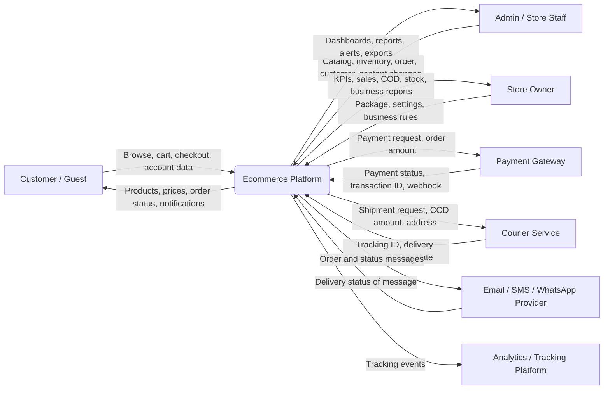
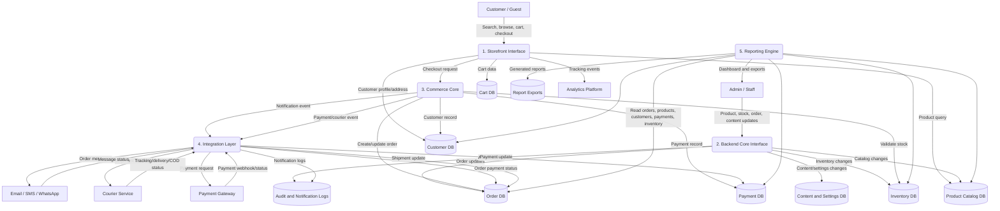
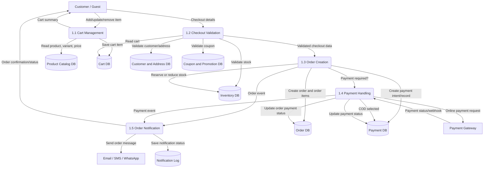
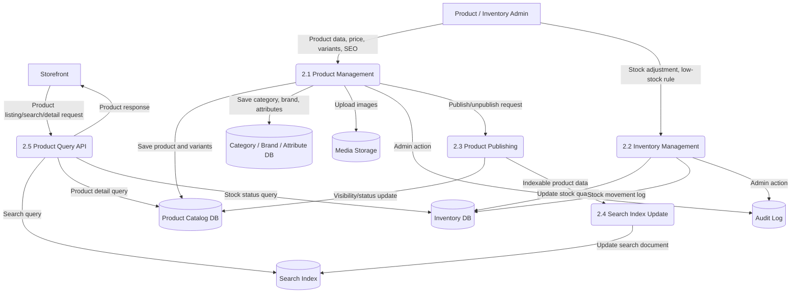
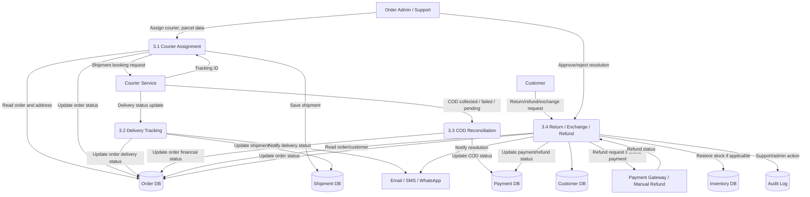
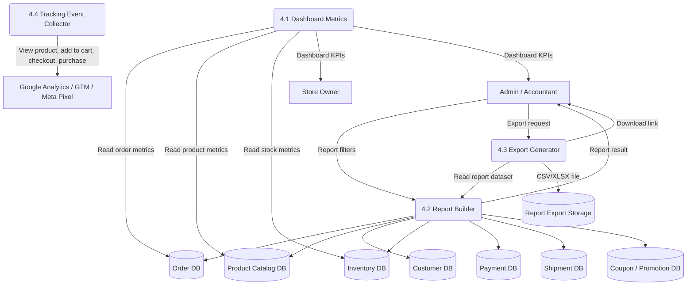
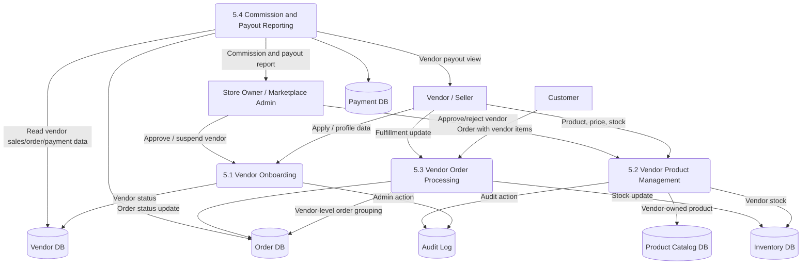

# Data Flow Diagram (DFD)

Project: Modular API-Based Ecommerce Platform  
Date: 12 April 2026  
Version: 1.0

## 1. Purpose

This document defines how data moves through the ecommerce platform. It covers the major external actors, system processes, data stores, and third-party integrations for the API-based ecommerce backend, admin panel, and customer storefront.

## 2. DFD Legend

- Rectangle: external actor or external system.
- Rounded rectangle: process.
- Cylinder: data store.
- Arrow: data movement.

## 3. Level 0 Context Diagram

## 4. Level 1 Platform Data Flow

## 5. Level 2 Checkout And Order Data Flow

## 6. Level 2 Product And Inventory Data Flow

## 7. Level 2 Delivery, COD, Return, And Refund Data Flow

## 8. Level 2 Reporting And Analytics Data Flow

## 9. Level 2 Optional Multi-Vendor Data Flow

## 10. Data Stores

| Data Store | Main Data |
|---|---|
| Vendor DB | Vendor profile, status, commission settings, payout information, vendor ownership boundaries |
| Product Catalog DB | Products, variants, SKU, prices, images, SEO fields, categories, brands, attributes |
| Customer DB | Customer profile, address, order history reference, support notes |
| Cart DB | Guest and customer cart items, quantities, coupon reference |
| Order DB | Orders, order items, statuses, invoices, notes, return/exchange state |
| Inventory DB | Stock quantity, reserved stock, low-stock threshold, stock movement history |
| Payment DB | Payment method, payment status, transaction ID, COD status, refund state |
| Shipment DB | Courier, tracking ID, delivery status, COD collection status |
| Content and Settings DB | Banners, pages, menus, store settings, package/module settings |
| Coupon and Promotion DB | Coupon rules, flash sale rules, free delivery rules, campaign settings |
| Audit and Notification Logs | Admin/vendor actions, notification attempts, webhook processing history |
| Report Export Storage | Generated CSV/XLSX report files |
| Media Storage | Product images, banners, imported files, documents |
| Search Index | Searchable product and category documents |

## 11. Important Data Control Rules

- Payment webhooks must be idempotent so duplicate callbacks do not double-confirm or double-refund an order.
- Inventory stock changes must always create stock movement records.
- Admin changes to order, payment, stock, permission, and settings must be audit logged.
- Disabled package modules must not expose data through admin menus, storefront UI, or API endpoints.
- Client business data must be exportable according to contract.
- Payment credentials, courier credentials, and API keys must be stored securely.
- Customer personal data must be protected with proper access control.
- Reports must read from source data without changing transactional records.
- In multi-vendor mode, vendors must only access their own products, order items, stock, and payout data.
- Each client deployment must keep database/storage isolated from other client deployments unless a future SaaS model is intentionally approved.
