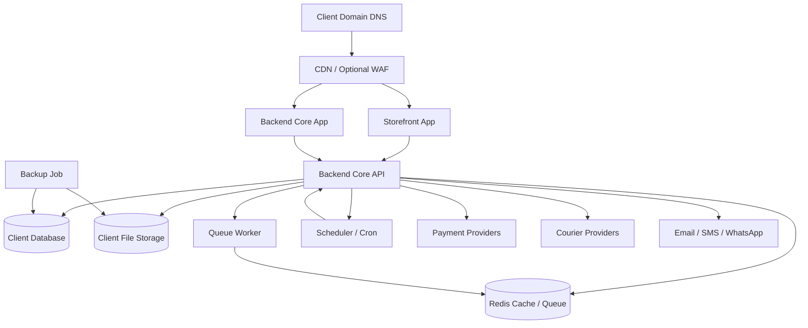
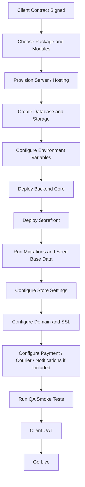

# DevOps / Deployment Architecture

Project: Modular API-Based Ecommerce Platform  
Date: 13 April 2026  
Version: 1.0

## 1. Purpose

This document defines the DevOps and deployment architecture for the modular ecommerce platform. It covers environment strategy, separate client deployments, CI/CD, infrastructure layout, secrets, queues, backups, monitoring, release process, rollback, and scaling.

The platform uses one maintained product codebase deployed separately per client. Each client deployment should have isolated runtime, database, storage, domain, and configuration. Single-vendor ecommerce is the default mode. Multi-vendor marketplace is an optional module.

## 2. Deployment Principles

- Use one maintained source codebase.
- Deploy separately per client by default.
- Keep each client's database and storage isolated.
- Keep environment variables and secrets separate per client and per environment.
- Use staging/UAT before production.
- Automate repeatable deployment steps.
- Run queue workers and schedulers separately from web requests.
- Take backups before major production releases.
- Make rollback possible and documented.
- Keep module/package configuration in database/settings, not code forks.

## 3. Environment Strategy

Recommended environments:

| Environment | Purpose | Data |
|---|---|---|
| Local | Developer workstations | Local/dev seed data |
| Development | Internal integration testing | Non-production data |
| Staging/UAT | Client testing and approval | Sanitized or client-approved test data |
| Production | Live storefront/admin/API | Real client data |

Rules:

- Production data must not be copied into local/dev environments without sanitization.
- Staging should mirror production config as closely as possible.
- Production debug mode must be disabled.
- Payment/courier sandbox credentials should be used in staging.
- Production payment/courier credentials must be used only in production.

## 4. Version 1 Deployment Topology

Recommended version 1 layout:

- One client per deployment.
- One production API/runtime per client.
- One production database per client.
- One production storage path/bucket per client.
- Queue worker process per client deployment.
- Scheduler/cron per client deployment.
- Optional CDN for storefront assets and product images.

## 5. Suggested Server Layout

Small deployment:

- 1 VPS/application server.
- Backend Core.
- Storefront build served by web server or separate node process.
- Queue worker.
- Scheduler/cron.
- Database on same VPS only for early/low-budget clients.
- Local or attached storage.

Recommended production deployment:

- 1 application server for API and frontend runtime.
- Managed database or separate database server.
- Redis service.
- Object storage or separate media volume.
- Automated backup storage.
- CDN for public assets.

Higher-scale deployment:

- Load balancer.
- Multiple API instances.
- Separate storefront/admin hosting.
- Managed database with backups.
- Redis/queue service.
- Search service.
- Object storage and CDN.
- Centralized logs and monitoring.

## 6. CI/CD Pipeline

Recommended pipeline stages:

```mermaid
flowchart LR
    A["Code Push / Merge"] --> B["Install Dependencies"]
    B --> C["Static Checks / Lint"]
    C --> D["Unit and Feature Tests"]
    D --> E["Build Frontend Apps"]
    E --> F["Build Backend Artifact / Docker Image"]
    F --> G["Deploy to Staging"]
    G --> H["Run Migrations"]
    H --> I["Smoke Test"]
    I --> J{"Approved?"}
    J -- "No" --> K["Stop / Fix"]
    J -- "Yes" --> L["Backup Production"]
    L --> M["Deploy Production"]
    M --> N["Run Migrations"]
    N --> O["Restart Queue Workers"]
    O --> P["Smoke Test Production"]
    P --> Q["Publish Release Notes"]
```

Pipeline rules:

- Do not deploy directly to production without staging/UAT for client-facing releases.
- Run migrations as a controlled step.
- Back up production before major migrations.
- Restart queue workers after deployment.
- Keep release notes per client deployment.

## 7. Branching And Release Strategy

Recommended branches:

- `main`: stable production-ready code.
- `develop`: integration branch if the team needs it.
- `release/*`: release candidates for staging/UAT.
- `hotfix/*`: urgent production fixes.
- `feature/*`: feature work.

Versioning:

- Use semantic versioning for platform releases where possible.
- Track which version each client deployment is running.
- Keep client-specific configuration outside code.
- Avoid permanent client-specific branches unless there is a signed custom scope.

## 8. Configuration And Secrets

Configuration sources:

- Environment variables.
- Encrypted database settings for provider credentials managed from admin UI.
- Store settings table for business-level settings.

Secrets:

- App key.
- Database credentials.
- Redis credentials.
- Payment provider credentials.
- Courier provider credentials.
- SMS/WhatsApp/email credentials.
- Object storage credentials.
- Webhook signing secrets.

Rules:

- Never commit `.env` files or secrets to source control.
- Use separate secrets per client and environment.
- Rotate credentials after staff/vendor compromise.
- Mask secrets in logs.
- Restrict who can update integration credentials.

## 9. Database Migration Strategy

Rules:

- All schema changes must use migrations.
- Migrations must be reviewed before production deployment.
- Destructive migrations require explicit backup and release note.
- Large data migrations should run as jobs or maintenance scripts, not during high-traffic hours.
- Rollback strategy must be known before production deployment.

Production migration flow:

1. Confirm backup success.
2. Put deployment in maintenance mode if needed.
3. Run migrations.
4. Clear/rebuild cache as needed.
5. Restart queue workers.
6. Run smoke tests.
7. Disable maintenance mode.

## 10. Queue, Scheduler, And Background Jobs

Queue jobs:

- Notifications.
- Payment webhook processing.
- Courier webhook processing.
- Product import.
- Report export.
- Product search indexing.
- Courier shipment creation.
- Low-stock alerts.

Rules:

- Queue workers must run continuously in production.
- Failed jobs must be monitored.
- Jobs that affect payment/order state must be idempotent.
- Queue workers must be restarted after deployment.
- Long-running imports/exports should not block checkout/admin actions.

Scheduler jobs:

- Backup trigger/check.
- Coupon activation/expiration.
- Report cleanup.
- Cart cleanup.
- Failed notification retry.
- Search index maintenance where needed.

## 11. Storage And Media Deployment

Storage options:

- Local storage for small deployments.
- Separate mounted volume for better persistence.
- S3-compatible object storage for scalable deployments.

Rules:

- Product images and banners must not be stored in source code directories.
- File uploads must be validated.
- Media must be backed up or stored in durable object storage.
- Public assets should use CDN where traffic requires it.
- Report exports should expire based on retention policy.

## 12. Backup And Restore Architecture

Backup scope:

- Database.
- Media/file storage.
- Environment/config reference, excluding raw secret exposure.

Recommended backup frequency:

- Daily database backup at minimum for managed hosting.
- More frequent backups for higher-value clients.
- Media backup daily or object storage versioning where available.

Backup rules:

- Backups must not be stored in public web directories.
- Backup access must be restricted.
- Backup failures must be monitored.
- Restore process must be documented.
- Restore should be tested for Professional/Enterprise packages.

Restore checklist:

1. Identify target restore point.
2. Confirm business approval for restore.
3. Put system in maintenance mode if restoring production.
4. Restore database.
5. Restore media/storage if needed.
6. Clear cache.
7. Restart workers.
8. Run smoke tests.
9. Confirm admin/storefront/order access.

## 13. Monitoring And Alerting

Monitor:

- API uptime.
- Storefront uptime.
- Backend Core uptime.
- Server CPU/memory/disk.
- Database availability and size.
- Slow database queries.
- Redis availability.
- Queue length.
- Failed jobs.
- Scheduler/cron execution.
- Payment webhook failures.
- Courier webhook failures.
- Backup success/failure.
- Error rate.
- Login failure spikes.

Recommended alerts:

- API down.
- Database down.
- Disk usage above threshold.
- Queue backlog above threshold.
- Backup failed.
- Payment webhook failures above threshold.
- Checkout error spike.
- Repeated failed admin login attempts.

## 14. Logging Strategy

Log categories:

- Application errors.
- Access logs.
- Payment webhook logs.
- Courier webhook logs.
- Failed jobs.
- Audit logs.
- Deployment logs.
- Backup logs.

Rules:

- Do not log passwords, tokens, API keys, webhook secrets, or full credentials.
- Mask sensitive customer/payment fields where possible.
- Keep audit logs separate from normal application debug logs.
- Production logs should not expose stack traces to users.

## 15. Deployment Checklist

Pre-deployment:

- Confirm target client and environment.
- Confirm release version.
- Confirm staging/UAT approval if required.
- Confirm backup plan.
- Confirm migrations.
- Confirm queue/scheduler changes.
- Confirm environment variables.
- Confirm provider credentials if integrations changed.

Deployment:

- Pull/build release artifact.
- Install dependencies.
- Build frontend apps.
- Enable maintenance mode if required.
- Run migrations.
- Clear/rebuild cache.
- Restart queue workers.
- Restart scheduler if needed.
- Disable maintenance mode.

Post-deployment smoke test:

- Storefront loads.
- Product listing loads.
- Product detail loads.
- Cart works.
- Checkout works in test path or safe smoke mode.
- Admin login works.
- Order list loads.
- Queue worker running.
- Scheduler running.
- Payment/courier webhooks reachable if enabled.

## 16. Rollback Strategy

Rollback types:

- Code rollback.
- Configuration rollback.
- Database rollback.
- Feature/module disable.

Rules:

- Prefer feature/module disable for faulty optional modules.
- Code rollback should return to previous known-good release.
- Database rollback is risky after destructive migrations; use backup/restore only with business approval.
- For payment/order bugs, preserve logs before rollback.
- Keep rollback notes in release log.

Rollback checklist:

1. Identify failed release and affected client.
2. Decide rollback type.
3. Put system in maintenance mode if needed.
4. Revert code or disable feature.
5. Restore database only if approved and necessary.
6. Restart workers.
7. Run smoke tests.
8. Notify stakeholder with outcome.

## 17. Scaling Path

Stage 1: Small client

- Single VPS.
- Local/attached database.
- Local media storage.
- Manual or simple automated backup.

Stage 2: Growing client

- Separate database service.
- Redis service.
- Queue worker process.
- CDN for assets.
- Automated backups.

Stage 3: High-traffic client

- Load balancer.
- Multiple API instances.
- Separate storefront hosting.
- Object storage.
- Dedicated search service.
- Centralized logs and monitoring.

Stage 4: Enterprise

- Read replica for reporting.
- Autoscaling app nodes.
- Advanced WAF/CDN.
- Dedicated integration workers.
- Disaster recovery plan.

## 18. Client Provisioning Workflow

## 19. Open DevOps Decisions

- Docker-first deployment or classic VPS deployment first.
- Managed database vs same-server database for Starter clients.
- Preferred cloud provider.
- Standard backup retention by package.
- Standard monitoring tool.
- Whether to use CDN by default or only Growth/Professional and above.
- Whether to use centralized deployment inventory for client versions.
- Standard rollback window and release approval policy.
