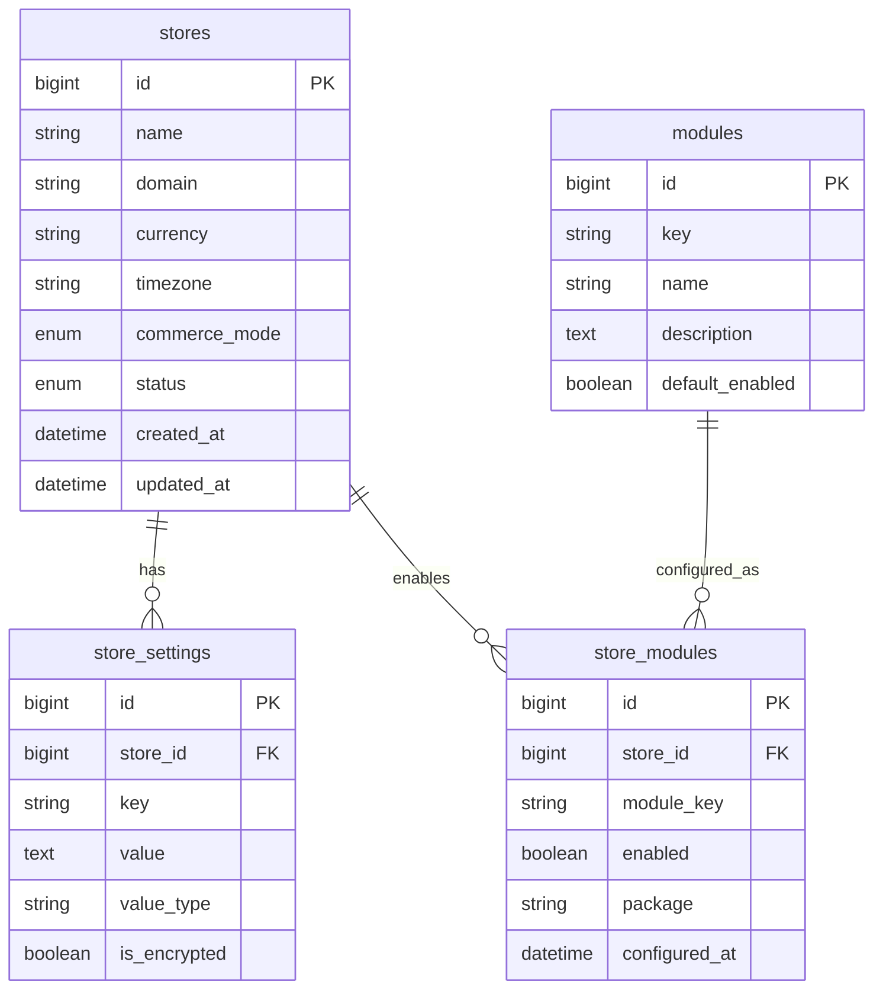
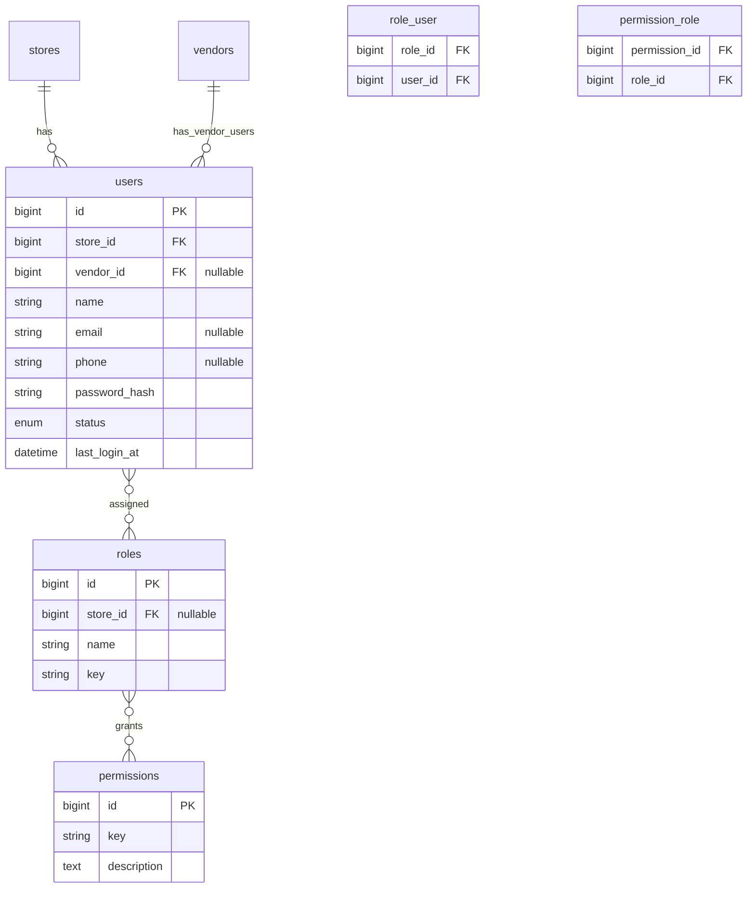
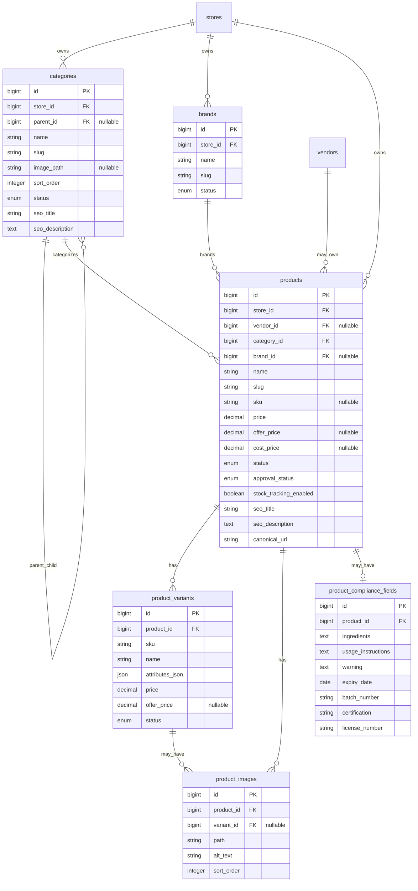
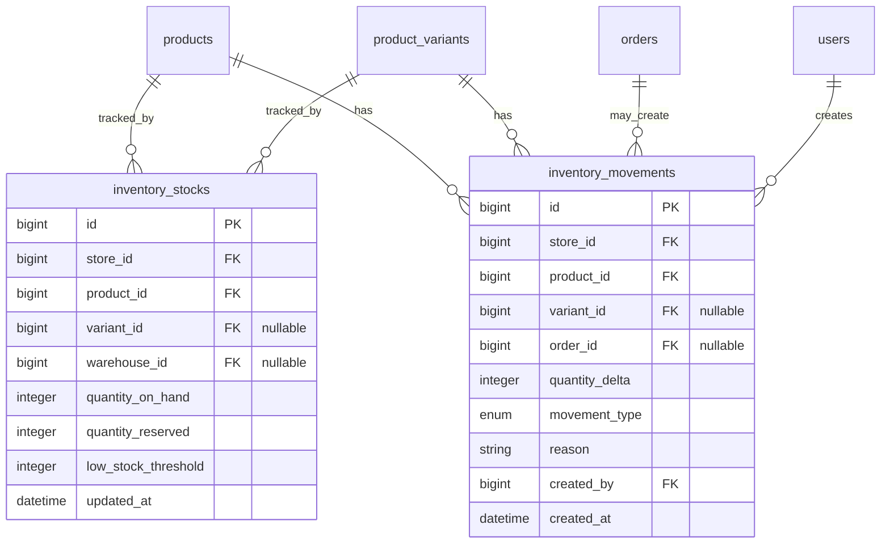
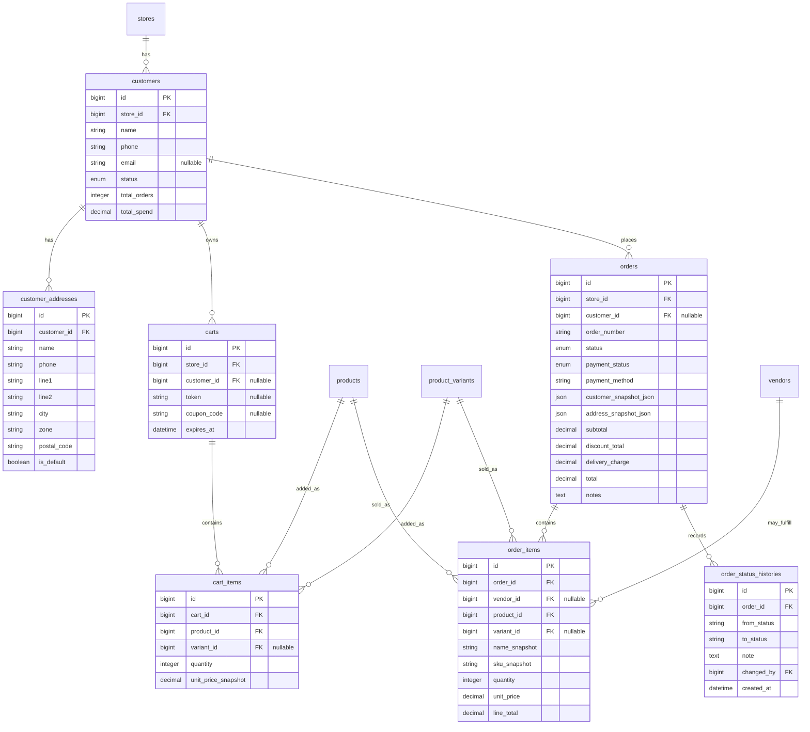
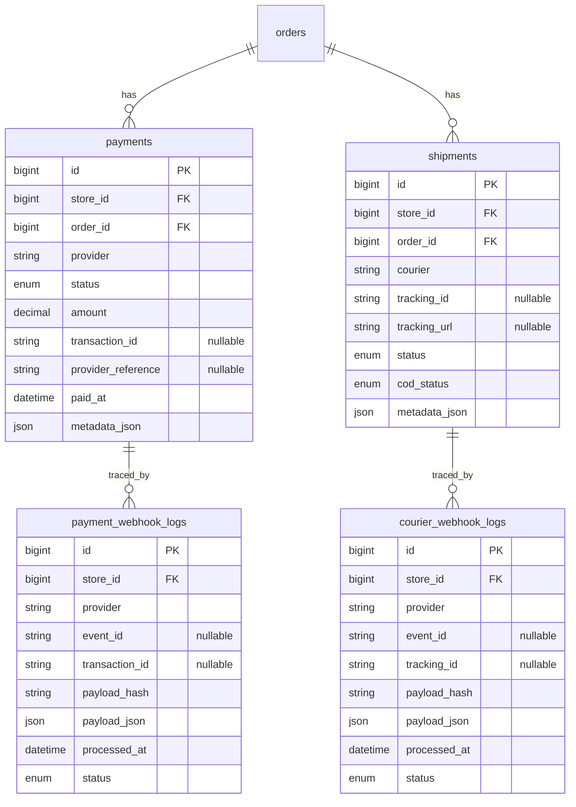
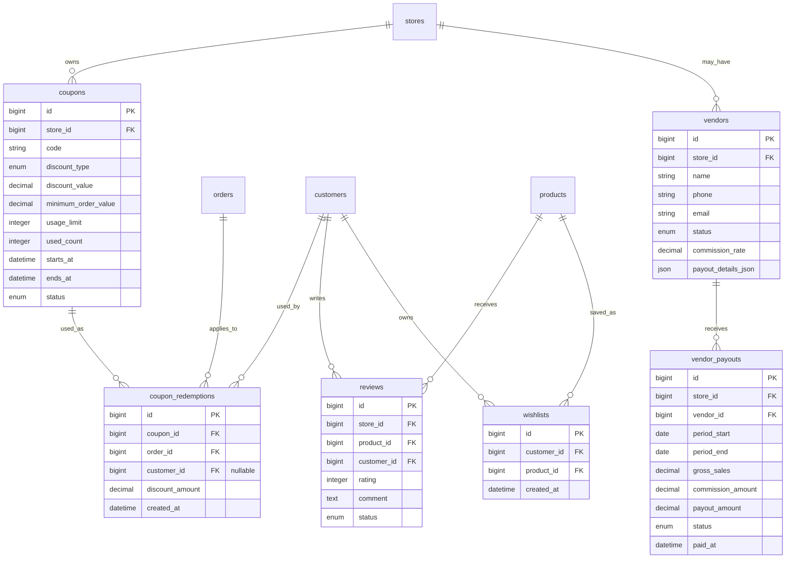
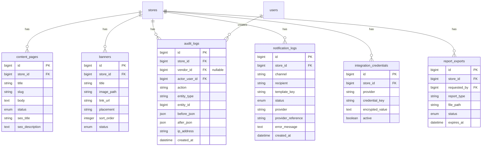

# Entity Relationship Diagram (ERD) - Database Design

Project: Modular API-Based Ecommerce Platform  
Date: 12 April 2026  
Version: 1.0

## 1. Purpose

This document defines the database entity relationship design for the modular ecommerce platform.

The platform uses one maintained product codebase deployed separately per client. Each client deployment should have isolated runtime, database, storage, domain, and configuration. Single-vendor ecommerce is the default mode. Multi-vendor marketplace is an optional module.

## 2. Database Design Principles

- Use a relational database as the primary transactional store.
- Keep `store_id` on store-owned tables to preserve future SaaS readiness, even when version 1 uses separate client deployments.
- Use `vendor_id` only where multi-vendor ownership is needed.
- Use snapshot fields for order/customer/address/product data so historical orders do not change when master data changes.
- Store stock changes in movement tables, not only in current stock quantity.
- Keep payment/courier webhook logs for idempotency and investigation.
- Keep audit logs for sensitive admin/vendor actions.
- Use encrypted storage for integration credentials and payout details where possible.

## 3. Full ERD Overview

```mermaid
erDiagram
    stores ||--o{ store_settings : has
    stores ||--o{ store_modules : enables
    modules ||--o{ store_modules : configured_as

    stores ||--o{ users : has
    vendors ||--o{ users : has_vendor_users
    users }o--o{ roles : assigned
    roles }o--o{ permissions : grants

    stores ||--o{ categories : owns
    categories ||--o{ categories : parent_child
    stores ||--o{ brands : owns
    stores ||--o{ products : owns
    vendors ||--o{ products : may_own
    categories ||--o{ products : categorizes
    brands ||--o{ products : brands
    products ||--o{ product_variants : has
    products ||--o{ product_images : has
    product_variants ||--o{ product_images : may_have
    products ||--o| product_compliance_fields : may_have

    products ||--o{ inventory_stocks : tracked_by
    product_variants ||--o{ inventory_stocks : tracked_by
    products ||--o{ inventory_movements : has
    product_variants ||--o{ inventory_movements : has

    stores ||--o{ customers : has
    customers ||--o{ customer_addresses : has
    customers ||--o{ carts : owns
    carts ||--o{ cart_items : contains
    products ||--o{ cart_items : added_as
    product_variants ||--o{ cart_items : added_as

    customers ||--o{ orders : places
    orders ||--o{ order_items : contains
    vendors ||--o{ order_items : may_fulfill
    products ||--o{ order_items : sold_as
    product_variants ||--o{ order_items : sold_as
    orders ||--o{ order_status_histories : records
    orders ||--o{ payments : has
    orders ||--o{ shipments : has

    stores ||--o{ coupons : owns
    coupons ||--o{ coupon_redemptions : used_as
    orders ||--o{ coupon_redemptions : applies_to
    customers ||--o{ coupon_redemptions : used_by

    customers ||--o{ reviews : writes
    products ||--o{ reviews : receives
    customers ||--o{ wishlists : owns
    products ||--o{ wishlists : saved_as

    stores ||--o{ vendors : may_have
    vendors ||--o{ vendor_payouts : receives

    stores ||--o{ content_pages : has
    stores ||--o{ banners : has
    stores ||--o{ audit_logs : has
    users ||--o{ audit_logs : creates
    stores ||--o{ notification_logs : has
    stores ||--o{ integration_credentials : has
    stores ||--o{ report_exports : has

    payments ||--o{ payment_webhook_logs : traced_by
    shipments ||--o{ courier_webhook_logs : traced_by
```

## 4. Store, Module, And Settings Entities

Key constraints:

- `stores.domain` should be unique.
- `store_settings(store_id, key)` should be unique.
- `modules.key` should be unique.
- `store_modules(store_id, module_key)` should be unique.
- `commerce_mode` should default to `single_vendor`.

## 5. User, Role, Permission, And Vendor Access

Key constraints:

- `users(store_id, email)` unique where email is not null.
- `users(store_id, phone)` unique where phone is not null.
- Vendor users must have `vendor_id` set only when multi-vendor mode is enabled.
- Vendor users must be scoped to their own vendor-owned data.

## 6. Catalog And Compliance Entities

Key constraints:

- `products(store_id, slug)` should be unique.
- `categories(store_id, slug)` should be unique.
- `brands(store_id, slug)` should be unique.
- `product_variants(product_id, sku)` should be unique where SKU is present.
- `product_compliance_fields.product_id` should be unique because one product has one compliance record.
- `vendor_id` on products is nullable for single-vendor mode.

## 7. Inventory Entities

Key constraints:

- `inventory_stocks(store_id, product_id, variant_id)` should be unique in version 1.
- `quantity_on_hand` and `quantity_reserved` should not go below zero.
- Every manual or order-driven stock change must create an `inventory_movements` row.
- Multi-warehouse can use `warehouse_id` later; nullable in version 1 and excluded from the v1 unique key to avoid nullable unique-index ambiguity.

## 8. Cart, Customer, And Order Entities

Key constraints:

- `orders(store_id, order_number)` should be unique.
- Guest orders may have `customer_id` null but must retain `customer_snapshot_json`.
- `order_items` must use snapshot fields for name, SKU, unit price, and line total.
- `order_items.vendor_id` is nullable in single-vendor mode and populated in multi-vendor mode.

## 9. Payment, Shipping, And Webhook Entities

Key constraints:

- `payments(provider, transaction_id)` should be unique where transaction ID is present.
- `payment_webhook_logs(provider, event_id)` should be unique where event ID is present.
- `payment_webhook_logs.payload_hash` helps detect duplicate payloads.
- `shipments(courier, tracking_id)` should be indexed where tracking ID is present.
- Webhook processing must be idempotent.

## 10. Promotion, Review, Wishlist, Vendor, And Support Entities

Key constraints:

- `coupons(store_id, code)` should be unique.
- `wishlists(customer_id, product_id)` should be unique.
- `reviews(product_id, customer_id)` may be unique if only one review per customer/product is allowed.
- Vendor payout details should be encrypted where possible.

## 11. Content, Audit, Notification, Integration, And Export Entities

Key constraints:

- `content_pages(store_id, slug)` should be unique.
- `integration_credentials(store_id, provider, credential_key)` should be unique.
- Audit logs should not be editable by normal admin users.
- Report exports should expire based on package/support policy.

## 12. Recommended Indexes

High-priority indexes:

- `products(store_id, slug)`
- `products(store_id, status)`
- `products(store_id, vendor_id)`
- `categories(store_id, slug)`
- `customers(store_id, phone)`
- `orders(store_id, order_number)`
- `orders(store_id, status, created_at)`
- `orders(store_id, payment_status)`
- `order_items(order_id)`
- `order_items(vendor_id)`
- `inventory_stocks(store_id, product_id, variant_id)`
- `inventory_movements(store_id, product_id, created_at)`
- `payments(order_id)`
- `payments(provider, transaction_id)`
- `shipments(order_id)`
- `shipments(courier, tracking_id)`
- `audit_logs(store_id, entity_type, entity_id)`
- `audit_logs(store_id, created_at)`

## 13. Notes For Version 1

- Separate client deployment means cross-client joins are not needed in version 1.
- Keeping `store_id` is still useful for consistency, future SaaS readiness, and internal platform tooling.
- Multi-vendor tables can exist but remain unused unless the module is enabled.
- Multi-warehouse support can be deferred while leaving `warehouse_id` nullable in inventory design; when enabled, use a non-null default warehouse or a revised stock key strategy.
- Compliance fields should be generic: `product_compliance_fields`, not category-specific names like herbal-only fields.
