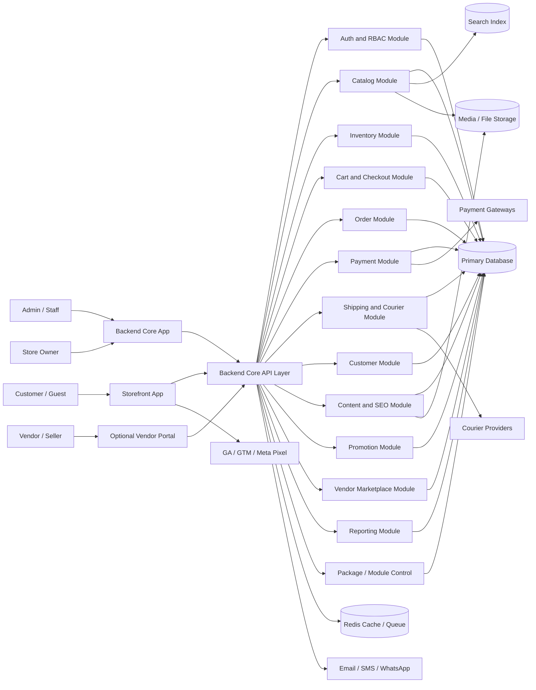
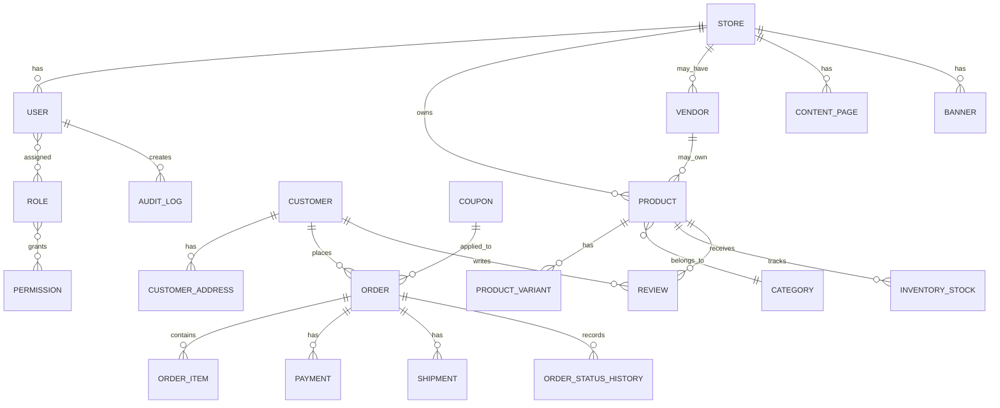
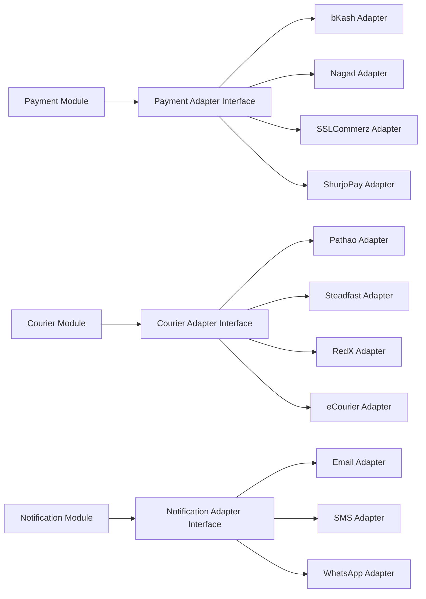
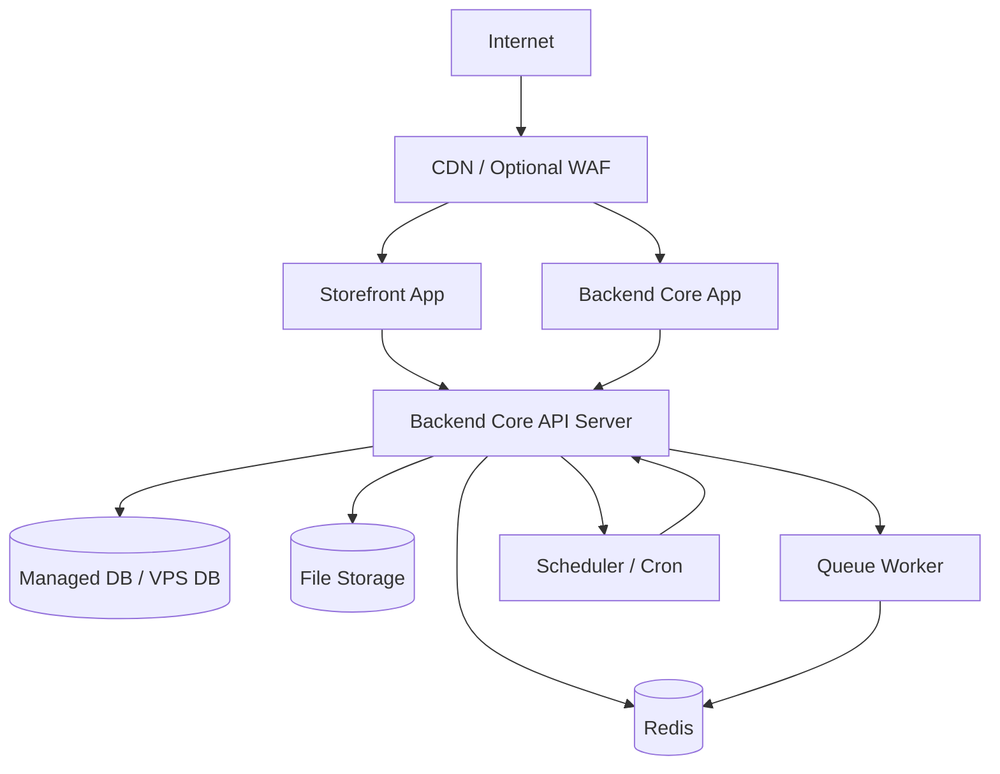

# High-Level Design (HLD) - System Architecture

Project: Modular API-Based Ecommerce Platform  
Date: 12 April 2026  
Version: 1.0

## 1. Purpose

This HLD defines the high-level system architecture for the modular ecommerce platform. It explains the major applications, backend services, data stores, integrations, deployment model, security boundaries, and scalability approach.

The architecture is designed for a reusable ecommerce product where the platform owner maintains one strong core system and enables features per client package. The intended version 1 model is not a CMS-style shared site builder; it is one product codebase deployed separately for each client.

## 2. Architecture Goals

- Separate the storefront app from the Backend Core app, while keeping the admin panel and backend API inside the Backend Core.
- Keep ecommerce business logic centralized in the backend.
- Support modular features and package-based enable/disable controls.
- Support separate deployment per client in version 1 while keeping a path to multi-tenant SaaS only if the business later chooses that model.
- Keep third-party integrations replaceable through adapters.
- Make the system secure, maintainable, scalable, and commercially reusable.
- Support single-vendor ecommerce by default.
- Support optional multi-vendor marketplace mode through vendor/seller modules.
- Support future mobile app, POS, warehouse app, vendor portal, and marketplace modules using the same API.

## 3. Architecture Style

Recommended style:

- Headless ecommerce architecture.
- API-first backend.
- Modular monolith for version 1.
- Event/queue-based processing for notifications, imports, exports, webhooks, and heavy jobs.
- Adapter-based third-party integrations.
- Future-ready for service extraction if scale requires it.

Reasoning:

For an early product, a modular monolith is usually better than microservices. It keeps development faster and operational complexity lower, while still allowing clean module boundaries. If traffic, team size, or client complexity grows, selected modules can later be extracted into separate services.

### 3.1 Deployment And Commerce Mode Clarification

Version 1 should use this model:

- One maintained product codebase.
- Separate deployment per client, usually separate server/VPS/cloud environment.
- Separate database and storage configuration per client.
- Single-vendor ecommerce mode enabled by default.
- Multi-vendor marketplace mode enabled only when the client purchases or needs it.
- No CMS-style shared admin where unrelated clients manage websites from the same content instance.
- Multi-tenant SaaS remains a future option, not the default architecture.

## 4. High-Level System Architecture

## 5. Main Applications

### 5.1 Storefront App

Purpose:

- Separate customer-facing ecommerce website consuming Backend Core APIs.

Responsibilities:

- Home, category, product listing, search, product detail, cart, checkout, account, order history, policy pages.
- SEO-friendly rendering.
- Mobile-first shopping experience.
- Tracking events for analytics and conversion platforms.

Recommended stack:

- Separate HTML/JS/jQuery/AJAX frontend or equivalent web frontend.

### 5.2 Backend Core App

Purpose:

- Central Laravel application for business owner and staff operations, admin panel pages, REST API, auth, business rules, and integrations.

Responsibilities:

- Dashboard, product management, inventory, orders, customers, ecommerce content management, promotions, reports, settings, roles, integrations, and audit logs.
- REST API endpoints for storefront and admin flows.
- Authentication and authorization.
- Payment/courier webhooks.
- Notification dispatch, jobs, reporting, and module/package enforcement.

Recommended stack:

- Laravel with admin panel pages, REST API, Sanctum, Spatie permissions, queue worker, and scheduler.

### 5.3 Optional Vendor Portal

Purpose:

- Vendor/seller operations when a client uses multi-vendor marketplace mode.

Responsibilities:

- Vendor product submission and management.
- Vendor order view and fulfillment actions.
- Vendor stock updates.
- Vendor sales and payout reports.
- Vendor profile management.

This app/module is disabled for normal single-vendor ecommerce clients.

## 6. Backend Module Architecture

```mermaid
flowchart TD
    Core["Core Platform"]
    Core --> Auth["Authentication / RBAC"]
    Core --> Store["Store Settings"]
    Core --> Module["Module and Package Control"]
    Core --> Audit["Audit Log"]

    Commerce["Commerce Domain"]
    Commerce --> Catalog["Catalog"]
    Commerce --> Inventory["Inventory"]
    Commerce --> Cart["Cart"]
    Commerce --> Checkout["Checkout"]
    Commerce --> Orders["Orders"]
    Commerce --> Customers["Customers"]
    Commerce --> Promotions["Promotions"]
    Commerce --> Vendors["Vendors / Marketplace"]

    Ops["Operations Domain"]
    Ops --> Payments["Payments"]
    Ops --> Shipping["Shipping / Courier"]
    Ops --> Notifications["Notifications"]
    Ops --> Reports["Reports"]
    Ops --> Imports["Import / Export"]

    Content["Content Domain"]
    Content --> ContentMgmt["Content Management"]
    Content --> SEO["SEO"]
    Content --> Media["Media"]

    Integrations["Integration Domain"]
    Integrations --> PayAdapter["Payment Adapters"]
    Integrations --> CourierAdapter["Courier Adapters"]
    Integrations --> MsgAdapter["Messaging Adapters"]
    Integrations --> AnalyticsAdapter["Analytics / Tracking"]
```

## 7. Core Modules

### 7.1 Authentication And RBAC

- Admin login.
- Customer login where enabled.
- Role and permission management.
- Optional admin 2FA.
- Token/session handling.
- Login throttling.

### 7.2 Store Settings And Module Control

- Store profile, currency, timezone, contact, logo, social links.
- Package-based feature enable/disable.
- Module dependency validation.
- Store-level configuration.
- Commerce mode selection: single-vendor or multi-vendor.

### 7.3 Catalog

- Products, variants, SKU, categories, brands, attributes, tags, images, SEO fields.
- Product status and visibility.
- Related, upsell, cross-sell support where enabled.

### 7.4 Inventory

- Stock per product/variant.
- Reserved stock.
- Stock movement history.
- Low-stock alerts.
- Stock restoration on cancellation/return.
- Future multi-warehouse support.

### 7.5 Cart And Checkout

- Guest cart and customer cart.
- Coupon and delivery charge calculation.
- Checkout validation.
- COD and online payment selection.
- Order creation.

### 7.6 Orders

- Order lifecycle.
- Status history.
- Admin notes.
- Invoice and packing slip.
- Return, refund, exchange where enabled.

### 7.7 Payment

- COD by default.
- Online payment adapters.
- Payment status tracking.
- Webhook verification.
- Idempotent payment updates.

### 7.8 Shipping And Courier

- Delivery zones and charges.
- Courier assignment.
- Tracking ID and URL.
- Courier adapter support.
- COD reconciliation where courier data exists.

### 7.9 Customer

- Customer profile.
- Address book.
- Order history.
- Wishlist and reviews where enabled.
- Customer notes and risk flags where enabled.

### 7.10 Vendor Marketplace

- Disabled by default.
- Vendor/seller account management.
- Vendor product ownership.
- Vendor product approval workflow where configured.
- Vendor-level order item grouping.
- Vendor commission rules.
- Vendor payout reporting.
- Vendor data isolation.
- Marketplace-wide admin control by store owner.

### 7.11 Content Management, SEO, And Marketing

- Homepage banners and sections.
- Static pages and policy pages.
- FAQ/blog where enabled.
- Meta fields, sitemap, robots.txt, structured data.
- GA/GTM/Meta Pixel tracking configuration.

### 7.12 Reporting

- Dashboard KPIs.
- Sales, order, product, customer, inventory, payment, refund, courier, coupon reports.
- CSV/XLSX exports.

## 8. Data Architecture

Primary data stores:

- Primary relational database: transactional business data.
- Redis: cache, queues, locks, rate limiting, background job state.
- Search index: product and category search documents.
- Media/file storage: product images, banners, imports, exports, documents.
- Logs: application logs, audit logs, webhook logs, notification logs.

## 9. API Architecture

API principles:

- Versioned API, for example `/api/v1`.
- JSON request/response.
- Separate public storefront endpoints and protected admin endpoints.
- Permission middleware for admin actions.
- Feature/module middleware for package enforcement.
- Rate limiting for login, checkout, search, and public APIs.
- Idempotent webhook processing for payments and couriers.
- OpenAPI/Swagger documentation.

Major API groups:

- `/auth`
- `/store`
- `/products`
- `/categories`
- `/cart`
- `/checkout`
- `/orders`
- `/customers`
- `/admin/products`
- `/admin/orders`
- `/admin/inventory`
- `/admin/reports`
- `/admin/settings`
- `/admin/modules`
- `/webhooks/payment`
- `/webhooks/courier`

## 10. Integration Architecture

All external integrations should use adapters.

Adapter rules:

- Core order/payment logic must not depend directly on a specific provider.
- Provider credentials must be stored securely.
- Webhook requests must be verified where provider supports verification.
- Failed integration calls must be logged and retryable where safe.
- Provider-specific errors must be normalized for the admin panel.

## 11. Deployment Architecture

### 11.1 Version 1 Deployment

Recommended version 1:

- Single client per deployment.
- Separate database per client.
- Separate storage path/bucket per client.
- Backend Core and storefront independently deployable.
- Queue worker and scheduler running separately from web process.
- Daily automated database backup.
- Environment variables for secrets.

### 11.2 Future Scalable Deployment

- Load balancer in front of API servers.
- Separate read replica for reports if required.
- Dedicated search service.
- S3-compatible object storage.
- CDN for images/static assets.
- Central logging and monitoring.
- Multi-tenant store isolation only if a SaaS model is intentionally adopted later.

## 12. Security Architecture

Security controls:

- Secure password hashing.
- RBAC for admin actions.
- Optional 2FA for admin.
- CSRF protection where session-based web flows exist.
- JWT/Sanctum/token handling depending on final stack.
- Input validation and output escaping.
- Protection against SQL injection, XSS, IDOR, broken access control, and brute force login.
- Rate limiting for login, checkout, search, and webhook endpoints.
- Secure storage for payment/courier/SMS credentials.
- Audit log for sensitive admin actions.
- Backup encryption where infrastructure supports it.
- Least-privilege server/database access.

Sensitive operations requiring audit log:

- Product price/stock changes.
- Order status changes.
- Payment/refund updates.
- Coupon changes.
- Staff role/permission changes.
- Store settings changes.
- Integration credential changes.

## 13. Scalability And Performance Architecture

Performance controls:

- Cache store settings, menus, categories, and high-traffic content.
- Use queue for notifications, imports, exports, webhooks, and report generation.
- Use search index for product search in larger packages.
- Optimize images and serve responsive sizes.
- Paginate admin and storefront lists.
- Add database indexes for order, customer, product, status, and date filters.

Scalability path:

1. Single server/VPS with separate processes.
2. Separate database and Redis.
3. CDN and object storage.
4. Dedicated search service.
5. Multiple API/frontend instances behind load balancer.
6. Read replica for reporting.
7. Extract high-load modules only if needed.

## 14. Separate Deployment And Future SaaS Readiness

Version 1 should use separate deployment per client. The design should still avoid blocking future SaaS, but SaaS is not the default architecture.

Readiness rules:

- Keep store/client ownership boundaries clear in the data model.
- Include `store_id` or tenant context only if multi-tenant mode is intentionally planned.
- Never hard-code client business rules in code.
- Keep store settings in database/configurable modules.
- Use module flags for package control.
- Keep media paths and integrations store-specific.
- Support custom domain mapping in future.
- Separate platform admin from store admin.
- In multi-vendor mode, include vendor ownership boundaries on vendor-managed products and order items.

## 15. Reliability, Backup, And Monitoring

Reliability:

- Daily backups for managed hosting at minimum.
- Restore procedure documentation.
- Queue retry policy for safe jobs.
- Failed job monitoring.
- Webhook logs for payment and courier updates.
- Health checks for API, queue, database, Redis, and storage.

Monitoring:

- Application error logs.
- Server CPU, memory, disk usage.
- Database size and slow queries.
- Queue length and failed jobs.
- Payment/courier webhook failures.
- Cron/scheduler execution.

## 16. Development And Release Architecture

Recommended environments:

- Local.
- Development.
- Staging/UAT.
- Production.

Release process:

- Code review.
- Automated tests.
- Build frontend apps.
- Run database migrations.
- Backup production before major release.
- Deploy Backend Core and storefront.
- Restart queue workers.
- Run smoke tests.
- Publish release notes.

## 17. Key Architecture Decisions

| Area | Decision | Reason |
|---|---|---|
| Product style | Backend Core plus separate storefront | Keeps admin and API together while preserving storefront flexibility |
| Backend shape | Modular monolith first | Faster development and simpler operations for early product |
| Integrations | Adapter-based | Easier to add/replace payment, courier, and messaging providers |
| Deployment | Separate deployment per client first | Best fit for controlled client projects, data isolation, and custom hosting |
| Future SaaS | Multi-tenant-ready only if later needed | Avoids CMS-style/shared-platform complexity in version 1 |
| Commerce mode | Single-vendor default, multi-vendor optional | Supports normal ecommerce and marketplace clients from one codebase |
| Modules | Package-based feature flags | Supports commercial packages and controlled upgrades |
| Jobs | Queue-based background work | Better performance and reliability |
| Data | Relational primary DB | Ecommerce needs transactional consistency |

## 18. Open Technical Decisions

- Final backend framework: Laravel or another stack.
- Final storefront framework: HTML/JS/jQuery/AJAX or another frontend stack.
- Final admin delivery style inside Backend Core: Laravel-served admin pages with JS/AJAX, or Blade/API hybrid.
- Whether multi-vendor marketplace is included in version 1 or delivered as a later enterprise module.
- First payment gateway to build.
- First courier provider to build.
- Search engine choice.
- Hosting standard and backup retention by package.
