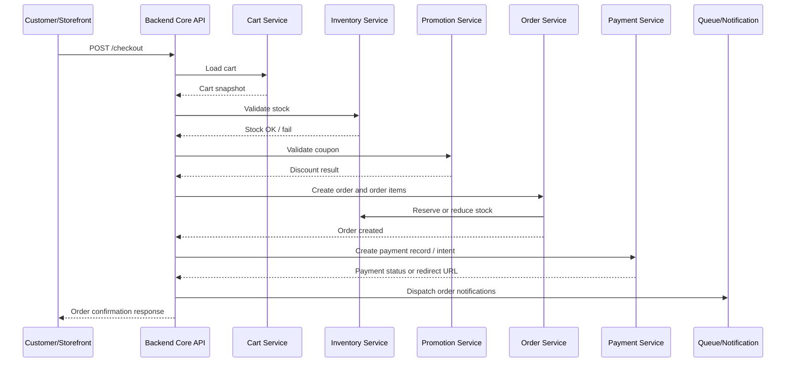
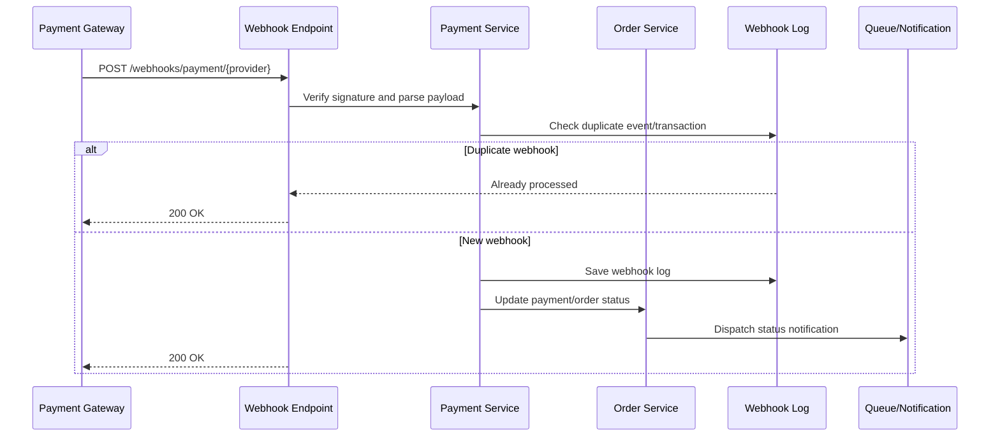
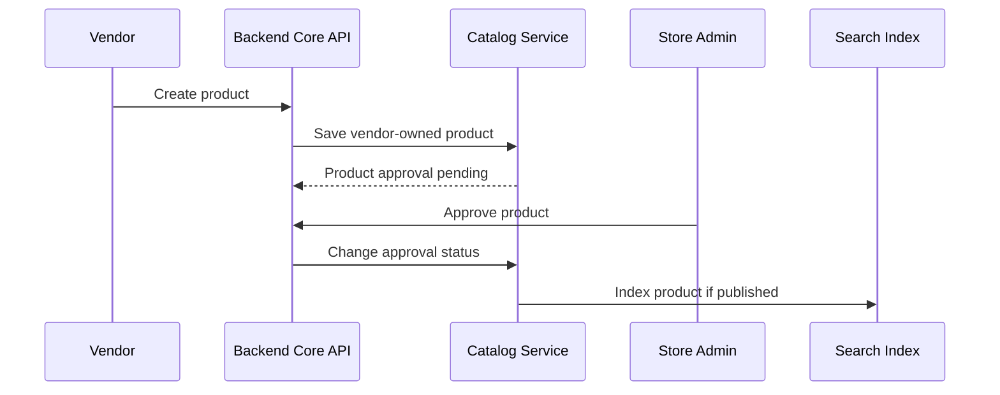

# Low-Level Design (LLD) - Detailed Design

Project: Modular API-Based Ecommerce Platform  
Date: 12 April 2026  
Version: 1.0

## 1. Purpose

This LLD defines the detailed implementation design for the modular ecommerce platform. It expands the HLD into concrete modules, data models, service responsibilities, workflows, jobs, validation rules, and implementation boundaries for a two-application model: Backend Core and Storefront.

The platform is not a CMS-style shared website builder. Version 1 uses one maintained product codebase deployed separately per client, with isolated runtime, database, storage, domain, and environment configuration. The Backend Core contains the admin panel, REST API, auth, business rules, jobs, and integrations. The Storefront is a separate frontend consuming Backend Core APIs. Single-vendor ecommerce is the default mode. Multi-vendor marketplace capability is an optional advanced module.

## 2. Design Principles

- Keep ecommerce business rules in the backend API, not in the storefront.
- Keep modules independent enough to enable/disable by package.
- Use a modular monolith first; extract services only when scale requires it.
- Use adapters for payment, courier, SMS, WhatsApp, email, and analytics providers.
- Keep client-specific settings in database/configuration, not code forks.
- Enforce permissions at API policy/middleware level.
- Treat every stock, payment, order, and permission change as auditable.
- Keep customer and vendor data boundaries strict.

## 3. Suggested Backend Code Structure

The Backend Core uses a simple modular Laravel structure. Laravel remains the application shell, `app/Core` contains shared reusable technical code, and each business feature lives under `app/Modules/<ModuleName>`.

```text
app/
  Core/
    Services/
    Repositories/
      Contracts/
    Support/

  Modules/
    <ModuleName>/
      Controllers/
      Requests/
      Resources/
      Services/
        Contracts/
      Repositories/
        Contracts/
      routes/
        web.php
        api.php
      views/
      Providers/
      Models/

  Http/
  Models/
  Providers/

bootstrap/
  app.php
  providers.php

routes/
  web.php
  api.php
  admin.php
  console.php

resources/
  views/

public/
  admin-assets/
```

Route loading:

- `bootstrap/app.php` loads Laravel's normal `routes/web.php` and `routes/api.php`.
- `config/modules.php` is the module registry for providers and route files.
- `routes/admin.php` reads `config/modules.php` and includes module admin/web routes such as `app/Modules/User/routes/web.php`.
- `routes/api.php` reads `config/modules.php` and includes module API routes such as `app/Modules/User/routes/api.php`.

Provider loading:

- `bootstrap/providers.php` registers `AppServiceProvider` and module providers from `config/modules.php`.
- Module providers own module bindings and view namespaces.
- `AppServiceProvider` should stay focused on global application bootstrapping.

Core usage:

- Base repositories live in `app/Core/Repositories`.
- Base services live in `app/Core/Services`.
- Shared response/logging helpers live in `app/Core/Support`.
- Business-specific code stays inside the related module.

Exception handling:

- API errors use the standard `ApiResponse::error()` shape.
- Web/admin errors use Laravel's normal web exception pages.
- Validation errors return `422 validation_failed`.
- Authentication errors return `401 unauthenticated`.
- Authorization errors return `403 forbidden`.
- Missing models or API routes return `404 not_found`.
- Rate limiting returns `429 too_many_requests`.
- Unexpected server errors return `500 server_error`.
- Request logging middleware logs failures and rethrows exceptions to the global handler.

Logging and trace correlation:

- Every request has a trace ID.
- Incoming `X-Request-Id` is reused when supplied.
- A UUID is generated when `X-Request-Id` is missing.
- Request logs include `trace_id`, method, path, IP, user ID, response status, duration, and exception details when failures occur.
- Responses include the `X-Request-Id` header so frontend/admin support can report the exact request reference.
- B1.6 does not require external tracing infrastructure.

Environment configuration:

- Infrastructure and deployment settings live in Laravel config files and `.env`.
- `env()` should only be used inside `config/*.php`.
- Application and module code should read configuration through `config()`.
- `config/modules.php` is the module registry.
- `config/store.php` contains store bootstrap defaults and shared conventions for future database-backed settings.
- Admin-editable business values should move to the settings table/module instead of remaining environment-only.

Internal coding standards:

- Controllers should stay thin.
- Business rules should live in services.
- Persistence queries should live in repositories.
- Validation should live in request classes.
- API responses should use the shared response helper.
- Shared technical behavior should move to `app/Core` only when reused across modules.

## 4. Layering Pattern

Controllers:

- Accept request.
- Authorize action.
- Validate input.
- Call application service/action.
- Return API resource/response.

Services/Actions:

- Own business rules.
- Coordinate repositories/models.
- Dispatch events/jobs.
- Write audit logs.

Models/Entities:

- Represent database records and relationships.
- Avoid placing complex workflow logic directly in models.

Policies/Middleware:

- Enforce RBAC, vendor ownership, module availability, and package permissions.

Adapters:

- Wrap external provider APIs.
- Normalize provider responses.
- Hide provider-specific details from core domain logic.

Jobs:

- Run slow or retryable work outside request lifecycle.

## 5. Core Database Tables

### 5.1 Store And Module Tables

`stores`

- `id`
- `name`
- `domain`
- `currency`
- `timezone`
- `commerce_mode`: `single_vendor` or `multi_vendor`
- `status`
- `created_at`, `updated_at`

`store_settings`

- `id`
- `store_id`
- `key`
- `value`
- `value_type`
- `is_encrypted`
- `created_at`, `updated_at`

`modules`

- `id`
- `key`
- `name`
- `description`
- `default_enabled`

`store_modules`

- `id`
- `store_id`
- `module_key`
- `enabled`
- `package`
- `configured_at`

### 5.2 User And Permission Tables

`users`

- `id`
- `store_id`
- `vendor_id`, nullable
- `name`
- `email`, nullable
- `phone`, nullable
- `password_hash`
- `status`
- `last_login_at`
- `created_at`, `updated_at`

`roles`

- `id`
- `store_id`, nullable for system roles
- `name`
- `key`

`permissions`

- `id`
- `key`
- `description`

`role_user`

- `role_id`
- `user_id`

`permission_role`

- `permission_id`
- `role_id`

### 5.3 Catalog Tables

`categories`

- `id`
- `store_id`
- `parent_id`, nullable
- `name`
- `slug`
- `image_path`, nullable
- `sort_order`
- `status`
- `seo_title`, `seo_description`

`brands`

- `id`
- `store_id`
- `name`
- `slug`
- `status`

`products`

- `id`
- `store_id`
- `vendor_id`, nullable
- `category_id`
- `brand_id`, nullable
- `name`
- `slug`
- `sku`, nullable
- `short_description`
- `description`
- `price`
- `offer_price`, nullable
- `cost_price`, nullable and permission-protected
- `status`: `draft`, `published`, `archived`
- `approval_status`: used for vendor products
- `stock_tracking_enabled`
- `seo_title`, `seo_description`, `canonical_url`
- `created_at`, `updated_at`

`product_variants`

- `id`
- `product_id`
- `sku`
- `name`
- `attributes_json`
- `price`
- `offer_price`, nullable
- `status`

`product_images`

- `id`
- `product_id`
- `variant_id`, nullable
- `path`
- `alt_text`
- `sort_order`

`product_compliance_fields`

- `id`
- `product_id`
- `ingredients`
- `usage_instructions`
- `warning`
- `expiry_date`
- `batch_number`
- `certification`

### 5.4 Inventory Tables

`inventory_stocks`

- `id`
- `store_id`
- `product_id`
- `variant_id`, nullable
- `warehouse_id`, nullable for future multi-warehouse
- `quantity_on_hand`
- `quantity_reserved`
- `low_stock_threshold`
- `updated_at`

`inventory_movements`

- `id`
- `store_id`
- `product_id`
- `variant_id`, nullable
- `order_id`, nullable
- `quantity_delta`
- `movement_type`: `manual_adjustment`, `order_reserved`, `order_released`, `sale`, `return`, `correction`
- `reason`
- `created_by`
- `created_at`

### 5.5 Customer, Cart, And Order Tables

`customers`

- `id`
- `store_id`
- `name`
- `phone`
- `email`, nullable
- `status`
- `total_orders`
- `total_spend`
- `created_at`, `updated_at`

`customer_addresses`

- `id`
- `customer_id`
- `name`
- `phone`
- `line1`
- `line2`
- `city`
- `zone`
- `postal_code`
- `is_default`

`carts`

- `id`
- `store_id`
- `customer_id`, nullable
- `token`, nullable for guest cart
- `coupon_code`, nullable
- `expires_at`

`cart_items`

- `id`
- `cart_id`
- `product_id`
- `variant_id`, nullable
- `quantity`
- `unit_price_snapshot`

`orders`

- `id`
- `store_id`
- `customer_id`, nullable
- `order_number`
- `status`
- `payment_status`
- `payment_method`
- `customer_snapshot_json`
- `address_snapshot_json`
- `subtotal`
- `discount_total`
- `delivery_charge`
- `total`
- `notes`
- `created_at`, `updated_at`

`order_items`

- `id`
- `order_id`
- `vendor_id`, nullable
- `product_id`
- `variant_id`, nullable
- `name_snapshot`
- `sku_snapshot`
- `quantity`
- `unit_price`
- `line_total`

`order_status_histories`

- `id`
- `order_id`
- `from_status`, nullable
- `to_status`
- `note`
- `changed_by`
- `created_at`

### 5.6 Payment And Shipping Tables

`payments`

- `id`
- `store_id`
- `order_id`
- `provider`: `cod`, `bkash`, `nagad`, `rocket`, `sslcommerz`, `shurjopay`, `bank_transfer`
- `status`: `unpaid`, `pending`, `paid`, `failed`, `refunded`, `partially_refunded`
- `amount`
- `transaction_id`, nullable
- `provider_reference`, nullable
- `paid_at`, nullable
- `metadata_json`
- `created_at`, `updated_at`

`payment_webhook_logs`

- `id`
- `store_id`
- `provider`
- `event_id`, nullable
- `transaction_id`, nullable
- `payload_hash`
- `payload_json`
- `processed_at`, nullable
- `status`

`shipments`

- `id`
- `store_id`
- `order_id`
- `courier`: `pathao`, `steadfast`, `redx`, `ecourier`, `manual`
- `tracking_id`, nullable
- `tracking_url`, nullable
- `status`
- `cod_status`: `not_applicable`, `pending`, `collected`, `remitted`, `failed`
- `metadata_json`
- `created_at`, `updated_at`

`courier_webhook_logs`

- `id`
- `store_id`
- `provider`
- `event_id`, nullable
- `tracking_id`, nullable
- `payload_hash`
- `payload_json`
- `processed_at`, nullable
- `status`

### 5.7 Content, Promotion, Vendor, And Audit Tables

`content_pages`

- `id`
- `store_id`
- `title`
- `slug`
- `body`
- `status`
- `seo_title`
- `seo_description`

`banners`

- `id`
- `store_id`
- `title`
- `image_path`
- `link_url`, nullable
- `placement`
- `sort_order`
- `status`

`coupons`

- `id`
- `store_id`
- `code`
- `discount_type`: `fixed`, `percentage`, `free_delivery`
- `discount_value`
- `minimum_order_value`, nullable
- `usage_limit`, nullable
- `used_count`
- `starts_at`, nullable
- `ends_at`, nullable
- `status`

`vendors`

- `id`
- `store_id`
- `name`
- `phone`
- `email`, nullable
- `status`: `pending`, `approved`, `suspended`, `rejected`
- `commission_rate`, nullable
- `payout_details_json`, encrypted where needed
- `created_at`, `updated_at`

`vendor_payouts`

- `id`
- `store_id`
- `vendor_id`
- `period_start`
- `period_end`
- `gross_sales`
- `commission_amount`
- `payout_amount`
- `status`: `draft`, `approved`, `paid`, `cancelled`
- `paid_at`, nullable

`audit_logs`

- `id`
- `store_id`
- `vendor_id`, nullable
- `actor_user_id`
- `action`
- `entity_type`
- `entity_id`
- `before_json`, nullable
- `after_json`, nullable
- `ip_address`, nullable
- `created_at`

`notification_logs`

- `id`
- `store_id`
- `channel`: `email`, `sms`, `whatsapp`
- `recipient`
- `template_key`
- `status`
- `provider`
- `provider_reference`, nullable
- `error_message`, nullable
- `created_at`

## 6. Module Detailed Design

### 6.1 Auth And RBAC Module

Responsibilities:

- Admin/staff login.
- Customer login and registration where enabled.
- Vendor login when multi-vendor module is enabled.
- Role and permission checks.
- Optional 2FA for admin/staff.
- Login throttling and account status checks.

Key services:

- `AuthService`
- `PasswordResetService`
- `RolePermissionService`
- `TwoFactorService`

Permission examples:

- `product.view`, `product.create`, `product.update`, `product.delete`
- `inventory.adjust`
- `order.view`, `order.update_status`, `order.refund`
- `payment.view`, `payment.refund`
- `settings.update`
- `vendor.manage`, `vendor.product.approve`, `vendor.payout.manage`

### 6.2 Store And Module Control

Responsibilities:

- Store profile and business settings.
- Active package and module flags.
- Commerce mode: `single_vendor` or `multi_vendor`.
- Module dependency checks.

Key rules:

- Disabled modules must be hidden from UI.
- Disabled modules must return `403 feature_unavailable` or equivalent from the API.
- Multi-vendor endpoints must not be available unless `multi_vendor` module is enabled.

### 6.3 Catalog Module

Responsibilities:

- Product/category/brand/attribute management.
- Product images and SEO fields.
- Compliance-sensitive product fields, such as ingredients, usage, warning, expiry, batch, certification, and license data.
- Product approval workflow for vendor products.
- Search indexing when search module is enabled.

Key services/actions:

- `ProductCreateAction`
- `ProductUpdateAction`
- `ProductPublishAction`
- `ProductApprovalAction`
- `ProductSearchService`
- `ProductIndexingJob`

Important rules:

- Product slug must be unique per store.
- Vendor product ownership must be enforced in multi-vendor mode.
- Cost price must be permission-protected.
- Published products must have price, category, status, and required stock behavior.

### 6.4 Inventory Module

Responsibilities:

- Track stock per product/variant.
- Maintain stock movement history.
- Reserve/release/reduce stock during order lifecycle.
- Trigger low-stock alerts.

Key services/actions:

- `StockAdjustmentAction`
- `ReserveStockAction`
- `ReleaseReservedStockAction`
- `CommitSaleStockAction`
- `RestoreReturnStockAction`

Stock rules:

- Manual adjustments always create `inventory_movements`.
- Order stock reduction timing is configurable: at order creation, confirmation, or packing.
- Cancellation restores reserved or reduced stock based on the previous movement type.
- Vendor users can adjust only their own product stock in multi-vendor mode.

### 6.5 Cart And Checkout Module

Responsibilities:

- Guest and customer carts.
- Cart item price/stock validation.
- Coupon validation.
- Delivery charge calculation.
- Order creation.
- Payment initiation.

Key services/actions:

- `CartService`
- `CartPriceCalculator`
- `CheckoutValidator`
- `CheckoutCreateOrderAction`
- `DeliveryChargeCalculator`

Checkout validation:

- Product exists and is published.
- Variant exists and is active.
- Stock is available.
- Price snapshot is current or accepted by configured rule.
- Coupon is active, valid for cart, and not over usage limit.
- Delivery zone is serviceable.
- Payment method is enabled.

### 6.6 Order Module

Responsibilities:

- Order creation and status transitions.
- Order status history.
- Admin notes.
- Invoice/packing slip.
- Return/refund/exchange where enabled.

Allowed order states:

- `pending`
- `awaiting_confirmation`
- `confirmed`
- `processing`
- `packed`
- `shipped`
- `delivered`
- `cancelled`
- `return_requested`
- `returned`
- `refunded`
- `failed_delivery`

State transition rules:

- `pending` -> `confirmed`, `cancelled`
- `confirmed` -> `processing`, `cancelled`
- `processing` -> `packed`, `cancelled`
- `packed` -> `shipped`, `cancelled`
- `shipped` -> `delivered`, `failed_delivery`, `returned`
- `delivered` -> `return_requested`
- `return_requested` -> `returned`, `delivered`

Every status change must create `order_status_histories` and `audit_logs`.
Refund, exchange, and store-credit resolutions are handled by the return/payment workflow; only configured order-level states should be written to `orders.status`.

### 6.7 Payment Module

Responsibilities:

- COD payment tracking.
- Online payment initiation.
- Payment webhook handling.
- Payment status update.
- Refund status update where supported.

Adapter interface:

```text
PaymentGatewayAdapter
  createPayment(order): PaymentIntent
  verifyWebhook(request): VerifiedWebhook
  parseWebhook(payload): PaymentEvent
  refund(payment, amount): RefundResult
```

Important rules:

- Payment webhook processing must be idempotent.
- Duplicate transaction IDs must not mark an order paid twice.
- Online payment success updates `payments` and `orders.payment_status`.
- COD orders can start as `unpaid` or `pending` depending on business configuration.

### 6.8 Shipping And Courier Module

Responsibilities:

- Delivery zones and charges.
- Courier assignment.
- Courier booking.
- Tracking ID and status update.
- COD reconciliation.

Adapter interface:

```text
CourierAdapter
  createShipment(order): ShipmentResult
  cancelShipment(shipment): CancelResult
  trackShipment(shipment): TrackingResult
  parseWebhook(payload): CourierEvent
```

Important rules:

- Courier webhooks must be idempotent.
- Manual courier mode must work without API integration.
- Delivery status changes may update order status based on store configuration.

### 6.9 Vendor Marketplace Module

Responsibilities:

- Vendor accounts.
- Vendor product ownership.
- Vendor product approval.
- Vendor order grouping.
- Vendor commission and payout reporting.

Important rules:

- Disabled by default.
- Vendor users only see their own products, order items, stock, and payout data.
- Store owner/admin keeps marketplace-wide authority.
- Product approval may be required before vendor product publication.
- Vendor commission may be global, per vendor, or per category in future.

## 7. Key Workflows

### 7.1 Checkout Workflow



### 7.2 Payment Webhook Workflow



### 7.3 Vendor Product Approval Workflow



## 8. Events And Jobs

Domain events:

- `OrderCreated`
- `OrderStatusChanged`
- `PaymentSucceeded`
- `PaymentFailed`
- `ShipmentCreated`
- `ShipmentStatusChanged`
- `StockLow`
- `ProductPublished`
- `ProductUpdated`
- `VendorApproved`
- `VendorProductSubmitted`
- `VendorProductApproved`

Queue jobs:

- `SendOrderConfirmationNotification`
- `SendOrderStatusNotification`
- `SendLowStockAlert`
- `SyncProductSearchIndex`
- `GenerateReportExport`
- `ImportProducts`
- `ProcessPaymentWebhook`
- `ProcessCourierWebhook`
- `CreateCourierShipment`

Retry rules:

- Notification jobs may retry safely.
- Webhook jobs must be idempotent.
- Payment refund jobs must be carefully guarded by transaction/reference ID.
- Import jobs must store row-level validation errors.

## 9. API Design Rules

- All API paths must be versioned under `/api/v1`.
- All responses use JSON.
- Public storefront endpoints may be unauthenticated.
- Admin endpoints require bearer token and permission checks.
- Vendor endpoints require multi-vendor module and vendor ownership checks.
- Feature-disabled endpoints return a clear `403 feature_unavailable` response.
- List endpoints use pagination.
- Checkout and webhook operations should use idempotency or duplicate detection.
- Errors should use a consistent structure:

```json
{
  "message": "Validation failed.",
  "code": "validation_error",
  "errors": {
    "phone": ["Phone is required."]
  }
}
```

## 10. Security Design

Authentication:

- Admin/staff: bearer token or Sanctum/JWT depending on final stack.
- Customer: bearer token where customer accounts are enabled.
- Vendor: vendor role plus active vendor status.
- Webhooks: provider signature or provider-specific verification.

Authorization:

- Use policies for entity-level checks.
- Use permissions for admin capabilities.
- Use module middleware for package/module access.
- Use vendor scope middleware for vendor-owned data.

Sensitive data:

- Passwords must be hashed.
- Payment/courier/SMS credentials must be encrypted.
- Payout details must be encrypted where possible.
- Audit logs must not be editable by normal admins.

Required audit log actions:

- Product price change.
- Product stock adjustment.
- Order status change.
- Payment/refund status change.
- Coupon change.
- Store setting change.
- Role/permission change.
- Vendor approval/suspension.
- Integration credential change.

## 11. Reporting Design

Reports should read from transactional tables but should not mutate business records.

Core reports:

- Sales by date range.
- Order status report.
- Product performance report.
- Customer report.
- Inventory and low-stock report.
- Payment and refund report.
- COD/courier report.
- Coupon performance report.
- Vendor sales and payout report when multi-vendor mode is enabled.

For larger datasets, report generation should run as a queued export job and store a downloadable CSV/XLSX file.

## 12. Indexing And Performance Notes

Recommended database indexes:

- `products(store_id, slug)`
- `products(store_id, status)`
- `products(store_id, vendor_id)`
- `orders(store_id, order_number)`
- `orders(store_id, status, created_at)`
- `orders(store_id, payment_status)`
- `order_items(order_id)`
- `order_items(vendor_id)`
- `customers(store_id, phone)`
- `inventory_stocks(store_id, product_id, variant_id)`
- `payments(order_id)`
- `payments(provider, transaction_id)`
- `shipments(order_id)`
- `audit_logs(store_id, entity_type, entity_id)`

Caching:

- Cache store settings.
- Cache active modules.
- Cache navigation/category tree.
- Cache public content pages and banners.
- Do not cache checkout totals without revalidation.

## 13. Testing Requirements

Unit tests:

- Coupon validation.
- Delivery charge calculation.
- Stock movement logic.
- Order state transitions.
- Payment webhook idempotency.
- Vendor ownership checks.

Feature/API tests:

- Guest COD checkout.
- Registered customer checkout.
- Admin product create/update.
- Admin order status update.
- Inventory adjustment.
- Disabled module access.
- Vendor product isolation.
- Vendor order isolation.
- Payment webhook success and duplicate webhook.
- Courier status webhook.

UAT tests:

- Product upload.
- Cart and checkout.
- COD order processing.
- Admin order fulfillment.
- Stock reduction and restoration.
- Customer notification.
- Report export.
- Multi-vendor flow if enabled.

## 14. Implementation Sequence

Recommended build order:

1. Store, settings, modules, auth, RBAC.
2. Catalog and content management.
3. Inventory.
4. Cart and checkout.
5. Order lifecycle.
6. COD payment flow.
7. Basic shipping zones and manual courier.
8. Dashboard and core reports.
9. Notifications.
10. Payment gateway adapters.
11. Courier adapters.
12. Reviews, wishlist, coupons, advanced promotions.
13. Vendor marketplace module.
14. Advanced reports, payout, multi-warehouse, and enterprise integrations.

## 15. Open Low-Level Decisions

- Final backend framework and exact folder convention.
- MySQL vs PostgreSQL.
- Redis queue driver vs another queue system.
- Search engine choice for growth packages.
- Whether stock reduces on order creation, confirmation, or packing by default.
- Whether vendor product approval is mandatory by default.
- Whether online payment order is created before or after gateway success.
- Exact invoice numbering format.
- Exact report export format and retention.
