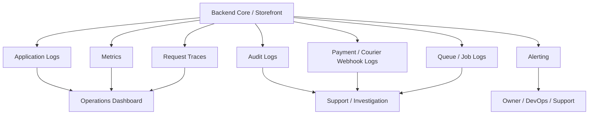

# Observability & Logging Design

Project: Modular API-Based Ecommerce Platform  
Date: 13 April 2026  
Version: 1.0

## 1. Purpose

This document defines the observability and logging design for the modular ecommerce platform. It covers application logs, audit logs, metrics, traces, dashboards, alerts, webhook monitoring, queue monitoring, backup monitoring, log retention, and incident investigation workflows.

The platform uses one maintained codebase deployed separately per client. Each client deployment should have isolated runtime, database, storage, domain, and configuration. Single-vendor ecommerce is the default mode. Multi-vendor marketplace is an optional module.

## 2. Observability Goals

- Detect checkout, payment, courier, and order-processing failures quickly.
- Help support teams investigate customer and admin issues.
- Track platform health per client deployment.
- Track queue, scheduler, webhook, and backup reliability.
- Provide auditability for business-critical changes.
- Avoid logging sensitive data such as passwords, tokens, API keys, payment secrets, and full customer/payment payloads.
- Support different observability levels by package if needed.

## 3. Observability Layers

## 4. Log Categories

### 4.1 Application Logs

Purpose:

- Track backend runtime errors, warnings, and important service-level events.

Examples:

- API exception.
- Failed validation pattern spike.
- External provider timeout.
- Search indexing failure.
- Report export failure.

Required fields:

- `timestamp`
- `level`
- `environment`
- `store_id`
- `request_id`
- `user_id`, nullable
- `vendor_id`, nullable
- `module`
- `message`
- `context`

### 4.2 Access Logs

Purpose:

- Track HTTP traffic and latency.

Required fields:

- `timestamp`
- `request_id`
- `method`
- `path`
- `status_code`
- `duration_ms`
- `ip_address`
- `user_agent`
- `user_id`, nullable
- `store_id`, nullable

Rules:

- Do not log full request bodies by default.
- Mask query values if sensitive.
- Track slow requests.

### 4.3 Audit Logs

Purpose:

- Provide business accountability for sensitive changes.

Required events:

- Product price change.
- Product publish/unpublish.
- Stock adjustment.
- Order status change.
- Payment/refund status change.
- Coupon change.
- Role/permission change.
- Store setting change.
- Module enable/disable.
- Vendor approval/suspension.
- Vendor payout change.
- Integration credential change.

Required fields:

- `store_id`
- `vendor_id`, nullable
- `actor_user_id`
- `action`
- `entity_type`
- `entity_id`
- `before_json`, masked where needed
- `after_json`, masked where needed
- `ip_address`
- `user_agent`
- `created_at`

### 4.4 Webhook Logs

Purpose:

- Debug payment and courier callback issues and enforce idempotency.

Payment webhook fields:

- `store_id`
- `provider`
- `event_id`, nullable
- `transaction_id`, nullable
- `payload_hash`
- `status`: `received`, `processed`, `duplicate`, `failed`, `rejected`
- `error_message`, nullable
- `processed_at`, nullable

Courier webhook fields:

- `store_id`
- `provider`
- `event_id`, nullable
- `tracking_id`, nullable
- `payload_hash`
- `status`: `received`, `processed`, `duplicate`, `failed`, `rejected`
- `error_message`, nullable
- `processed_at`, nullable

Rules:

- Do not store secrets from webhook headers.
- Mask sensitive payload fields.
- Duplicate webhooks should be logged as `duplicate`, not treated as fatal.

### 4.5 Queue And Job Logs

Purpose:

- Track background processing reliability.

Required fields:

- `job_id`
- `job_name`
- `queue`
- `store_id`, nullable
- `attempt`
- `status`: `queued`, `processing`, `completed`, `failed`, `retried`
- `duration_ms`
- `error_message`, nullable
- `created_at`
- `processed_at`

Critical jobs:

- Payment webhook processing.
- Courier webhook processing.
- Order notifications.
- Product import.
- Report export.
- Product search indexing.
- Courier shipment creation.
- Backup job/check.

## 5. Metrics Design

### 5.1 Business Metrics

Track per client/store:

- Orders created.
- Orders delivered.
- Orders cancelled.
- Failed delivery rate.
- Gross sales.
- Net sales.
- COD pending amount.
- Refund amount.
- Average order value.
- Coupon usage.
- Top-selling products.
- Low-stock product count.
- Vendor sales and payout amount where multi-vendor is enabled.

### 5.2 Application Metrics

Track:

- API request count.
- API error rate.
- API latency p50/p95/p99.
- Slow endpoints.
- Checkout success/failure rate.
- Login failure rate.
- Search response time.
- Report export duration.
- Product import duration and failure count.

### 5.3 Infrastructure Metrics

Track:

- CPU usage.
- Memory usage.
- Disk usage.
- Database availability.
- Database size.
- Slow queries.
- Redis availability.
- Queue length.
- Failed job count.
- Scheduler last run time.
- Backup success/failure.

### 5.4 Integration Metrics

Track:

- Payment webhook success/failure count.
- Payment provider timeout count.
- Duplicate payment webhook count.
- Courier webhook success/failure count.
- Courier booking success/failure count.
- Notification provider success/failure count.
- SMS/WhatsApp/email delivery failures.

## 6. Tracing Design

Use request IDs/correlation IDs across services and logs.

Required correlation fields:

- `request_id`
- `order_number`, where relevant
- `payment_transaction_id`, where relevant
- `tracking_id`, where relevant
- `job_id`, for queued work
- `store_id`
- `vendor_id`, where relevant

Trace high-risk flows:

- Checkout.
- Payment initiation.
- Payment webhook.
- Order status update.
- Courier booking.
- Courier webhook.
- Stock adjustment.
- Report export.
- Product import.

## 7. Alerting Design

Critical alerts:

- API down.
- Storefront down.
- Backend Core down.
- Database down.
- Redis/queue down.
- Disk usage above threshold.
- Backup failed.
- Checkout error spike.
- Payment webhook failures above threshold.
- Courier webhook failures above threshold.
- Queue backlog above threshold.
- Repeated failed admin login attempts.

Warning alerts:

- Slow API p95 above threshold.
- Product import failure.
- Report export failure.
- Notification delivery failure spike.
- Search indexing failure.
- Low disk warning.
- Scheduler did not run.

Recommended initial thresholds:

- API 5xx rate above 2% for 5 minutes.
- Checkout failure rate above 5% for 5 minutes.
- Queue backlog older than 10 minutes for critical queues.
- Disk usage above 80% warning, 90% critical.
- Backup missing or failed for 24 hours.
- Payment webhook failure count above 5 in 10 minutes.

## 8. Dashboard Design

### 8.1 Operations Dashboard

Widgets:

- API uptime.
- API p95 latency.
- API 5xx error rate.
- Checkout success/failure count.
- Queue length.
- Failed jobs.
- Database health.
- Redis health.
- Disk usage.
- Last backup time.
- Last scheduler run.

### 8.2 Ecommerce Health Dashboard

Widgets:

- Orders today.
- Gross sales today.
- Pending orders.
- Failed delivery count.
- COD pending amount.
- Payment failures.
- Courier booking failures.
- Low-stock products.
- Top failed checkout reasons.

### 8.3 Integration Dashboard

Widgets:

- Payment provider success/failure by provider.
- Duplicate payment webhooks.
- Courier booking success/failure.
- Courier webhook failures.
- Notification success/failure by channel.

### 8.4 Vendor Dashboard

Only when multi-vendor module is enabled:

- Vendor order count.
- Vendor sales.
- Vendor pending fulfillment.
- Vendor payout pending.
- Vendor product approval pending.

## 9. Log Retention Policy

Suggested defaults:

| Log Type | Starter | Growth | Professional | Enterprise |
|---|---:|---:|---:|---:|
| Application logs | 7 days | 14 days | 30 days | 90 days |
| Access logs | 7 days | 14 days | 30 days | 90 days |
| Audit logs | 90 days | 180 days | 365 days | Custom |
| Webhook logs | 30 days | 60 days | 180 days | 365 days |
| Queue job logs | 14 days | 30 days | 60 days | 180 days |
| Backup logs | 30 days | 90 days | 180 days | 365 days |

Rules:

- Audit logs may need longer retention based on client contract.
- Sensitive data must be masked before storing logs.
- Logs should not be publicly accessible.
- Log export should be permission-controlled.

## 10. Incident Investigation Workflows

### 10.1 Customer Says Payment Was Made But Order Is Unpaid

Steps:

1. Search by `order_number`.
2. Check `payments` table/status.
3. Check payment webhook logs by transaction ID/provider.
4. Check duplicate or failed webhook status.
5. Check application logs with request ID/webhook event ID.
6. If provider confirms payment, update through approved admin flow and audit the action.

### 10.2 Customer Says Order Was Placed But No Confirmation

Steps:

1. Search by phone/order number.
2. Check order creation log.
3. Check notification logs.
4. Check queue failed jobs.
5. Resend notification if order exists and notification failed.

### 10.3 Stock Is Incorrect

Steps:

1. Check `inventory_stocks`.
2. Review `inventory_movements`.
3. Review related order/cancellation/return history.
4. Check manual adjustment audit logs.
5. Apply correction through inventory adjustment with reason.

### 10.4 Courier Status Mismatch

Steps:

1. Search shipment by tracking ID.
2. Check courier webhook logs.
3. Check courier provider dashboard.
4. Check order status history.
5. Update shipment/order through approved admin flow if needed.

### 10.5 Vendor Cannot See Order/Product

Steps:

1. Confirm multi-vendor module is enabled.
2. Confirm vendor status is approved.
3. Confirm authenticated user has correct `vendor_id`.
4. Confirm product/order item has matching `vendor_id`.
5. Check permission/policy denial logs.

## 11. Data Privacy And Redaction

Never log:

- Passwords.
- Password reset tokens.
- Access tokens.
- API keys.
- Webhook secrets.
- Full payment credentials.
- Full integration credential payloads.

Mask where possible:

- Customer phone.
- Customer email.
- Address.
- Payment transaction metadata.
- Vendor payout details.

Example masking:

- `01712345678` -> `017****5678`
- `customer@example.com` -> `c******r@example.com`

## 12. Tooling Options

Simple/startup option:

- Framework logs.
- Database-backed audit logs.
- Queue failed-job table.
- Basic server monitoring.
- Uptime monitor.

Growth option:

- Centralized log storage.
- Metrics dashboard.
- Queue dashboard.
- Error tracking tool.
- Backup monitoring.

Enterprise option:

- Full APM/tracing.
- Centralized logging stack.
- Custom dashboards per client.
- Alert routing and incident management.
- Long-term audit retention.

Possible tools:

- Application logs: framework logging, ELK/OpenSearch, Loki.
- Metrics: Prometheus/Grafana or hosted APM.
- Errors: Sentry or equivalent.
- Uptime: UptimeRobot, Better Stack, or equivalent.
- Queue dashboard: framework queue dashboard where available.

## 13. Open Observability Decisions

- Final logging stack for version 1.
- Whether each client has separate log storage or centralized platform log storage.
- Exact alerting tool.
- Exact retention policy by package.
- Whether to include APM in all packages or only Professional/Enterprise.
- Whether clients can access their own operational dashboard.
