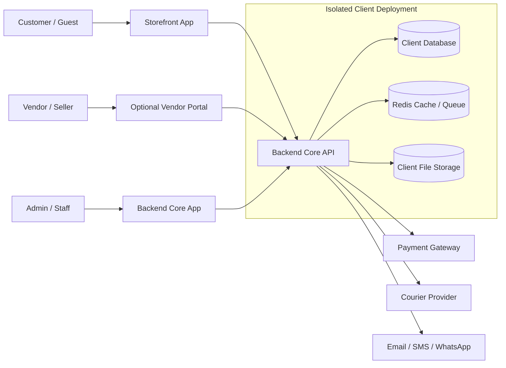

# Security Design

Project: Modular API-Based Ecommerce Platform  
Date: 13 April 2026  
Version: 1.0

## 1. Purpose

This document defines the security design for the modular ecommerce platform. It covers authentication, authorization, API security, data protection, vendor isolation, payment and courier webhook security, audit logging, infrastructure hardening, backup security, and operational security.

The platform uses one maintained codebase deployed separately per client. Each client should have isolated runtime, database, storage, domain, and configuration. Single-vendor ecommerce is the default mode. Multi-vendor marketplace is an optional module and requires strict vendor data isolation.

## 2. Security Goals

- Protect customer, order, payment, vendor, and business data.
- Prevent unauthorized admin, vendor, and customer access.
- Enforce package/module restrictions at API and UI level.
- Keep vendor data isolated in multi-vendor mode.
- Prevent payment, refund, stock, and order workflow manipulation.
- Secure third-party payment, courier, SMS, WhatsApp, and email credentials.
- Maintain reliable audit trails for sensitive operations.
- Keep backups protected and restorable.
- Reduce common web risks: SQL injection, XSS, CSRF, IDOR, broken access control, brute force, and webhook replay.

## 3. Security Boundaries

Boundary rules:

- Storefront can access only public storefront APIs and authenticated customer APIs.
- Backend Core admin interface can access admin APIs only after authentication and permission checks.
- Vendor portal can access vendor APIs only when multi-vendor module is enabled and vendor is approved.
- Third-party providers must only communicate through verified webhook endpoints.
- Each client deployment must keep database/storage isolated from other clients unless a future SaaS model is intentionally approved.

## 4. Authentication Design

User types:

- Admin/staff users.
- Store owner.
- Customer users.
- Vendor users when multi-vendor module is enabled.
- Platform/super admin if central management tooling is added later.

Controls:

- Passwords must be hashed using a secure framework-supported hashing algorithm.
- Login attempts must be rate limited.
- Failed login attempts must be logged.
- Suspended users must not authenticate.
- Optional 2FA should be available for admin/staff users and required for higher-value deployments.
- Password reset tokens must be short-lived and single-use.
- Session/token expiration must be enforced.
- Logout must revoke the current token/session.

Recommended token approach:

- Admin/vendor/customer APIs: bearer token using Sanctum
- Webhooks: provider signature or provider-specific verification, not normal user tokens.

## 5. Authorization And RBAC

Authorization layers:

- Role-based access control for admin/staff capabilities.
- Policy checks for entity ownership.
- Module middleware for package/module access.
- Vendor scope middleware for multi-vendor data access.
- Store scope enforcement on all store-owned records.

Example permissions:

- `product.view`
- `product.create`
- `product.update`
- `product.delete`
- `inventory.adjust`
- `order.view`
- `order.update_status`
- `order.refund`
- `payment.view`
- `payment.refund`
- `customer.view`
- `report.view`
- `settings.update`
- `coupon.manage`
- `vendor.manage`
- `vendor.product.approve`
- `vendor.payout.manage`

Rules:

- Admin UI hiding is not enough; API must enforce permissions.
- Disabled modules must return `403 feature_unavailable` or equivalent.
- Normal staff cannot manage roles/permissions unless explicitly granted.
- Cost price, payment data, payout data, and integration credentials must require elevated permission.

## 6. Vendor Isolation Design

Vendor isolation applies only when multi-vendor mode is enabled.

Rules:

- Vendor user must have `vendor_id`.
- Vendor user can only view/update products where `products.vendor_id = current_vendor_id`.
- Vendor user can only view order items where `order_items.vendor_id = current_vendor_id`.
- Vendor user can only view inventory for their own products.
- Vendor user can only view payout records for their own vendor account.
- Vendor user cannot change marketplace-wide settings, payment gateway settings, courier settings, categories, or global policies unless store owner explicitly grants special permission.
- Store owner/admin retains marketplace-wide control.

Risk controls:

- Add vendor ownership tests for every vendor endpoint.
- Never trust `vendor_id` from request body; derive it from authenticated user context.
- Vendor report queries must include vendor scope.
- Audit vendor product, stock, order, and payout actions.

## 7. API Security

Controls:

- Use HTTPS only.
- Use API versioning, for example `/api/v1`.
- Validate all request bodies, query params, and path params.
- Use consistent authorization middleware on admin/vendor routes.
- Use rate limiting on login, checkout, search, order lookup, and webhooks.
- Use idempotency keys for checkout and payment-sensitive operations where applicable.
- Use strict pagination limits.
- Do not expose internal exception traces in production.
- Use standard error responses without leaking secrets or SQL details.

Common API risks:

- IDOR: prevent by checking store ownership, customer ownership, and vendor ownership.
- Mass assignment: whitelist allowed fields.
- Broken access control: use policies and test every role.
- Replay attacks: use webhook signatures, event IDs, payload hashes, and timestamps where providers support them.

## 8. Input Validation And Web Protection

Required protections:

- SQL injection prevention through parameterized queries/ORM.
- XSS prevention through output escaping and safe rich-text handling.
- CSRF protection where cookie/session web flows exist.
- File upload validation for product images, banners, import files, and documents.
- MIME type and file extension validation.
- File size limits.
- Image processing safety checks.
- Sanitization for rich text content pages and product descriptions.
- Server-side validation for price, stock, coupon, order, payment, and refund fields.

File upload rules:

- Store uploads outside executable code paths.
- Generate safe file names.
- Avoid trusting original file names.
- Restrict allowed file types.
- Scan files if antivirus tooling is available in the hosting plan.

## 9. Payment Security

Controls:

- Payment credentials must be encrypted at rest.
- Payment provider callbacks/webhooks must be verified.
- Webhook processing must be idempotent.
- Transaction IDs must be stored and checked for duplicates.
- Payment state changes must be audit logged.
- Refunds must require elevated permission.
- Manual payment status changes must require note/reason.
- Payment response payloads should be stored carefully and must not expose sensitive card/payment details.

Payment state rules:

- Gateway success may mark payment `paid`.
- Gateway failure must not mark order paid.
- Duplicate gateway success must not double-confirm order.
- Refund must update payment and order status according to workflow rules.

## 10. Courier And COD Security

Controls:

- Courier credentials must be encrypted at rest.
- Courier webhooks must be verified where provider supports verification.
- Courier webhook processing must be idempotent.
- Manual courier status updates must require permission and audit log.
- COD reconciliation updates must be audit logged.
- COD amount mismatch must be flagged for review.

COD risk controls:

- Track COD states separately: `pending`, `collected`, `remitted`, `failed`, `disputed`.
- Keep courier reference/tracking ID.
- Keep manual adjustment notes.
- Include COD discrepancy reports.

## 11. Data Protection

Sensitive data:

- Password hashes.
- Customer phone/email/address.
- Order history.
- Payment transaction data.
- Integration credentials.
- Vendor payout details.
- Admin audit logs.

Controls:

- Encrypt integration credentials.
- Encrypt payout details where possible.
- Restrict access to customer exports.
- Restrict access to payment/refund reports.
- Mask sensitive fields in logs.
- Do not log passwords, tokens, API keys, webhook secrets, or full credential payloads.
- Use least-privilege database and server access.

Data ownership:

- Client business data belongs to the client.
- Platform source code ownership remains with platform owner unless separately contracted.
- Client data export should be available by permission-controlled admin action.

## 12. Audit Logging

Audit logs must capture:

- Actor user ID.
- Store ID.
- Vendor ID where applicable.
- Action.
- Entity type and ID.
- Before/after values where feasible.
- IP address and user agent where available.
- Timestamp.

Required audit events:

- Product price change.
- Product status/publish change.
- Stock adjustment.
- Order status change.
- Payment/refund status change.
- Coupon create/update/delete.
- Store setting change.
- Role/permission change.
- Vendor approval/suspension.
- Vendor payout change.
- Integration credential change.
- Module enable/disable.

Rules:

- Audit logs should not be editable by normal admins.
- Audit logs should have retention policy based on support/hosting package.
- Sensitive values should be masked in audit diffs.

## 13. Secrets And Credential Management

Secrets include:

- App key.
- Database password.
- Redis password.
- Payment gateway keys.
- Courier API keys.
- SMS/WhatsApp/email provider keys.
- Webhook signing secrets.
- Object storage keys.

Controls:

- Use environment variables or secure secret storage.
- Never commit secrets into source code.
- Use separate secrets per client deployment.
- Rotate secrets when staff/vendor compromise is suspected.
- Restrict who can view/update integration credentials.
- Store provider credentials encrypted in database when managed from admin UI.

## 14. Backup And Recovery Security

Controls:

- Backups must be access-controlled.
- Backup files should be encrypted where infrastructure supports it.
- Backup retention must be defined by package.
- Restore process must be documented.
- Restore should be tested for higher-value packages.
- Backup access must be limited to technical/admin operations staff.
- Backups must not be stored in public web directories.

Risk controls:

- Take backup before major production release.
- Monitor backup failures.
- Keep database and media/file backup strategy aligned.

## 15. Infrastructure And Deployment Security

Controls:

- HTTPS/TLS for all production traffic.
- Disable debug mode in production.
- Use firewall/security groups to restrict database and Redis access.
- Keep database and Redis private to the application network where possible.
- Use least-privilege server users.
- Keep dependencies patched.
- Run migrations through controlled deployment process.
- Restart queue workers after deployment.
- Use separate staging/UAT and production environments.
- Use separate `.env`/secrets per environment.

Monitoring:

- Application errors.
- Failed jobs.
- Webhook failures.
- Login failures.
- Disk usage.
- Database size and slow queries.
- Queue length.
- Backup success/failure.

## 16. Frontend Security

Storefront:

- Avoid exposing admin or internal API keys.
- Sanitize rich text content before rendering.
- Use secure checkout flows.
- Use trusted analytics/tracking scripts only.

Backend Core admin interface:

- Require authentication.
- Enforce permission-based menu visibility.
- Confirm sensitive actions such as refund, stock adjustment, integration credential change, and module disable.
- Avoid storing tokens in unsafe locations where possible.

Vendor portal:

- Only available when multi-vendor module is enabled.
- Enforce vendor scope in every API call.
- Do not expose marketplace-wide reports/settings.

## 17. Threat Model Summary

| Threat                       | Risk                                         | Control                                                     |
| ---------------------------- | -------------------------------------------- | ----------------------------------------------------------- |
| Admin account compromise     | Unauthorized order/payment/settings changes  | 2FA, RBAC, audit logs, login throttling                     |
| Vendor data leakage          | Vendor sees another vendor's products/orders | Vendor scope middleware, policy tests                       |
| Payment webhook replay       | Duplicate payment/refund update              | Signature verification, event ID, payload hash, idempotency |
| COD manipulation             | Wrong collection/remittance reporting        | COD state tracking, audit logs, reconciliation reports      |
| IDOR                         | User accesses another user's data            | Ownership checks on every entity                            |
| XSS in product/content pages | Script injection into storefront/admin       | Sanitization, escaping, safe rich text handling             |
| File upload abuse            | Malware or executable upload                 | File type/size validation, safe storage path                |
| Secret leakage               | Provider/account compromise                  | Env secrets, encryption, no secret logging                  |
| Data loss                    | Lost orders/customer records                 | Automated backup, restore procedure, monitoring             |
| Broken module control        | Client accesses unpaid module                | Module middleware and UI/API checks                         |

## 18. Security Testing Requirements

Required tests:

- Admin login throttling.
- RBAC permission denial.
- Store ownership checks.
- Customer order ownership checks.
- Vendor ownership checks.
- Disabled module endpoint denial.
- Product price/stock audit log.
- Order status audit log.
- Payment webhook duplicate handling.
- Courier webhook duplicate handling.
- File upload validation.
- Coupon abuse and duplicate usage prevention.
- Refund permission checks.

Recommended manual checks:

- Try changing IDs in API requests to access other records.
- Try vendor endpoint with another vendor's product/order ID.
- Try disabled module endpoints.
- Try duplicate payment webhook payload.
- Try invalid file upload type.
- Try production error response to confirm no stack trace is exposed.

## 19. Open Security Decisions

- Exact auth implementation: Sanctum, JWT, or another token system.
- Whether admin 2FA is mandatory for all clients or only Professional/Enterprise.
- Backup encryption mechanism by hosting provider.
- Whether to add antivirus scanning for file uploads in version 1.
- Exact audit log retention policy per package.
- Whether to use centralized log monitoring in version 1 or only for higher packages.
