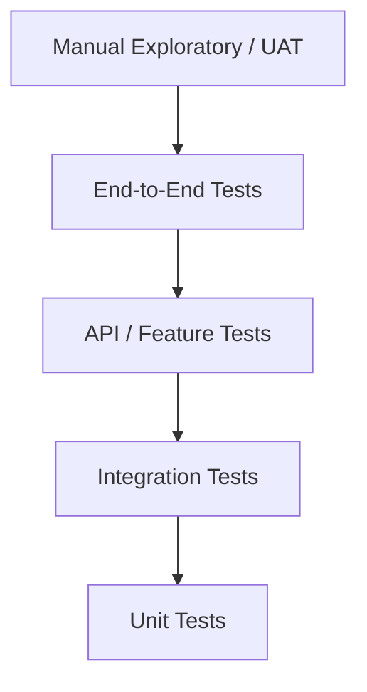

# Testing Strategy

Project: Modular API-Based Ecommerce Platform  
Date: 13 April 2026  
Version: 1.0

## 1. Purpose

This document defines the testing strategy for the modular ecommerce platform. It covers testing levels, scope, test environments, critical ecommerce scenarios, automation strategy, security testing, performance testing, UAT, release gates, and regression testing.

The platform uses separate deployment per client, single-vendor ecommerce by default, and optional multi-vendor marketplace mode.

## 2. Testing Goals

- Ensure customers can browse, cart, checkout, and place orders reliably.
- Ensure Backend Core admin users can manage products, inventory, orders, customers, content, reports, and settings.
- Ensure payment and courier integrations behave safely and idempotently.
- Ensure inventory remains accurate across order, cancellation, return, and manual adjustment flows.
- Ensure vendor isolation works when multi-vendor mode is enabled.
- Ensure disabled modules are blocked at UI and API level.
- Ensure security and RBAC controls are enforced.
- Ensure releases do not break live ecommerce operations.

## 3. Test Pyramid

Recommended emphasis:

- Many unit tests for business rules.
- Strong API/feature tests for ecommerce flows.
- Focused integration tests for providers.
- A small but critical set of end-to-end tests.
- Manual UAT for client-specific launch approval.

## 4. Test Environments

| Environment | Purpose | Test Type |
|---|---|---|
| Local | Developer validation | Unit, feature, local integration |
| Development | Internal integration | API, module, smoke |
| Staging/UAT | Client approval | UAT, integration sandbox, regression |
| Production | Live verification | Smoke, monitoring only |

Rules:

- Do not use real payment charges in local/development.
- Use payment/courier sandbox credentials in staging when available.
- Production tests must avoid creating real unwanted orders unless marked/test-safe.
- Production smoke tests should use safe paths or a configured test product/order flow.

## 5. Unit Testing Strategy

Unit tests should cover isolated business rules.

Required unit test areas:

- Coupon validation.
- Delivery charge calculation.
- Cart total calculation.
- Stock reservation/release/reduction logic.
- Order state transition rules.
- Payment state transition rules.
- Shipment state transition rules.
- Return/refund/exchange eligibility.
- Module dependency validation.
- Vendor ownership rules.
- Commission and payout calculation.
- SEO slug generation.

Example cases:

- Invalid coupon is rejected after expiry date.
- Free delivery coupon applies only above minimum order value.
- Stock cannot go below zero.
- `shipped` order cannot be cancelled by normal staff.
- Vendor cannot access another vendor's product ID.
- Duplicate payment transaction ID is ignored safely.

## 6. API / Feature Testing Strategy

API/feature tests should cover full backend flows without relying on browser automation.

Critical API tests:

- Customer registration and login.
- Admin login and permission denial.
- Product create/update/publish.
- Product list/search/detail.
- Add to cart.
- Checkout as guest.
- Checkout as registered customer.
- COD order creation.
- Admin order status update.
- Inventory stock adjustment.
- Order cancellation and stock restoration.
- Coupon application and invalid coupon rejection.
- Customer order lookup.
- Module disabled endpoint returns forbidden/feature unavailable.
- Vendor product listing is vendor-scoped.
- Vendor order group listing is vendor-scoped.

## 7. End-To-End Testing Strategy

E2E tests should cover a small number of high-value browser flows.

Recommended E2E flows:

- Customer browses product, adds to cart, places COD order.
- Customer creates account, adds address, places order.
- Admin logs in, creates product, publishes product, sees it on storefront.
- Admin receives order, confirms, packs, ships, marks delivered.
- Admin creates coupon, customer uses coupon at checkout.
- Vendor logs in, submits product, admin approves, product appears on storefront when multi-vendor mode is enabled.

E2E tools:

- Playwright or Cypress.

Rules:

- Keep E2E suite small and stable.
- Use seeded test data.
- Avoid depending on real third-party payment/courier providers in normal E2E tests.

## 8. Integration Testing Strategy

Integration tests should cover external service adapters and infrastructure boundaries.

Payment provider tests:

- bKash sandbox payment success.
- bKash sandbox payment failure.
- Nagad/SSLCommerz/ShurjoPay equivalent success/failure where available.
- Duplicate webhook event.
- Invalid webhook signature.
- Refund response handling where provider supports it.

Courier provider tests:

- Shipment booking success.
- Shipment booking failure.
- Tracking update.
- Duplicate courier webhook.
- Invalid courier webhook.
- Manual courier fallback.

Messaging tests:

- Email notification sends.
- SMS provider failure logs correctly.
- WhatsApp provider failure logs correctly.
- Notification retry behavior.

## 9. Security Testing Strategy

Required security tests:

- Login rate limiting.
- Invalid token rejected.
- Expired token rejected.
- Admin permission denial.
- Customer cannot access another customer's order.
- Vendor cannot access another vendor's products/orders/payouts.
- Disabled module endpoint denied.
- Product cost price visible only to permitted roles.
- Refund endpoint requires elevated permission.
- Integration credentials not returned in plain API response.
- File upload rejects invalid type and oversized file.
- Production errors do not expose stack traces.
- Payment webhook with invalid signature is rejected.
- Duplicate payment webhook does not double-update.

Manual security checks:

- Change IDs in API requests to test IDOR.
- Try hidden admin routes with lower-privilege user.
- Try vendor routes with another vendor's entity ID.
- Try XSS payload in product description/content page.
- Try invalid/malicious import file.

## 10. Performance Testing Strategy

Performance goals should be finalized per package, but baseline tests should include:

- Product listing under expected catalog size.
- Product search/filter.
- Product detail page API.
- Cart update.
- Checkout.
- Admin order list.
- Admin report generation.

Recommended baseline targets:

- Common API reads under 500ms server response under normal load.
- Checkout should complete without timeout under expected load.
- Report exports should run in background for large datasets.
- Search should move to dedicated search service when database search becomes slow.

Load test scenarios:

- 50 concurrent storefront users browsing products.
- 20 concurrent users adding to cart.
- 10 concurrent checkout attempts.
- Admin filtering order list during customer traffic.

## 11. Data And Migration Testing

Required tests:

- Fresh migration runs successfully.
- Seed data creates required roles, permissions, modules, and base settings.
- Migration runs on staging copy before production.
- Rollback plan is known for risky migrations.
- Product import validates rows and reports row-level errors.
- Order/customer/product export produces expected columns.

Data quality checks:

- Product slugs are unique per store.
- Order numbers are unique per store.
- Stock quantity cannot become negative.
- Coupon usage count increments correctly.
- Vendor-owned products have correct `vendor_id`.

## 12. Regression Test Suite

Core regression suite:

- Auth and RBAC.
- Product catalog.
- Inventory.
- Cart and checkout.
- COD order lifecycle.
- Coupon.
- Customer account.
- Admin order management.
- Reports.
- Module enable/disable.
- Audit logging.

Extended regression suite:

- Payment gateways.
- Courier integrations.
- SMS/WhatsApp/email.
- Return/refund/exchange.
- Vendor marketplace.
- Advanced promotions.
- Bulk import/export.

## 13. UAT Strategy

UAT should be performed on staging/UAT environment before client go-live.

UAT checklist:

- Storefront branding and content checked.
- Product list and product detail checked.
- Mobile responsiveness checked.
- Cart and checkout checked.
- COD order placed.
- Payment gateway checked if included.
- Courier flow checked if included.
- Admin product management checked.
- Admin order management checked.
- Stock update checked.
- Customer notification checked.
- Policy pages checked.
- Reports checked.
- Role access checked.
- Vendor workflow checked if multi-vendor module is included.

UAT sign-off should include:

- Client representative name.
- Date.
- Tested package/modules.
- Known issues accepted for go-live, if any.
- Blockers to resolve before go-live.

## 14. Release Gate Criteria

Minimum gate before staging:

- Unit tests pass.
- Feature/API tests pass.
- Migrations pass on clean database.
- No critical lint/static check errors.
- Build succeeds.

Minimum gate before production:

- Staging deployment complete.
- Smoke tests pass.
- Client/UAT approval where required.
- Production backup confirmed.
- Migration risk reviewed.
- Rollback plan defined.
- Queue/scheduler changes reviewed.

Critical production blockers:

- Checkout broken.
- Payment success/failure handling broken.
- Admin cannot process orders.
- Inventory reduces incorrectly.
- Unauthorized admin/vendor/customer access.
- Data migration loss/corruption.
- Production secrets missing or exposed.

## 15. Production Smoke Test

After production deployment:

- Storefront loads.
- Product listing loads.
- Product detail loads.
- Cart add/update works.
- Checkout safe/test path works.
- Backend Core admin login works.
- Admin order list loads.
- Product edit screen loads.
- Queue worker is running.
- Scheduler is running.
- Payment/courier webhook endpoints are reachable if enabled.
- Error logs show no immediate critical errors.

## 16. Bug Severity Levels

P0 - Critical:

- Checkout unavailable.
- Payment processing corrupts order/payment state.
- Data loss.
- Unauthorized access to sensitive data.
- Admin cannot process live orders.

P1 - High:

- Major order workflow broken.
- Inventory wrong after common flow.
- Payment/courier integration failure for active client.
- Vendor isolation bug.
- Production report/export failure affecting operations.

P2 - Medium:

- Non-critical admin function broken.
- Minor report mismatch.
- UI issue affecting some users but workaround exists.
- Notification failure where order is still created.

P3 - Low:

- Copy/style issue.
- Minor layout issue.
- Non-critical enhancement.

## 17. Test Automation Ownership

Recommended ownership:

- Backend engineers: unit, feature/API, integration adapter tests.
- Frontend engineers: storefront/admin component and E2E tests.
- QA engineer: regression, UAT checklist, exploratory tests.
- DevOps engineer: deployment smoke, backup/restore, monitoring checks.
- Product/business owner: UAT acceptance and package-specific scenario review.

## 18. Open Testing Decisions

- Final E2E tool: Playwright or Cypress.
- Minimum coverage target for backend unit/feature tests.
- Whether payment/courier sandbox tests run in CI or only staging.
- Standard test data seed format.
- Whether production smoke tests create real test orders or use safe dry-run endpoints.
- Bug tracking tool and test case management tool.
