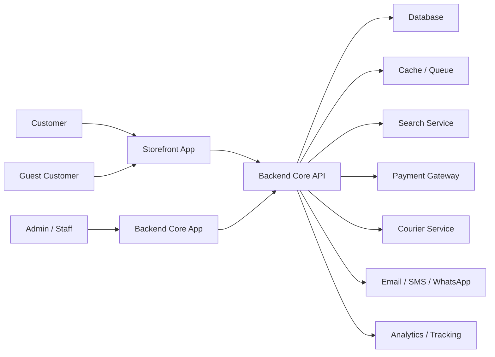
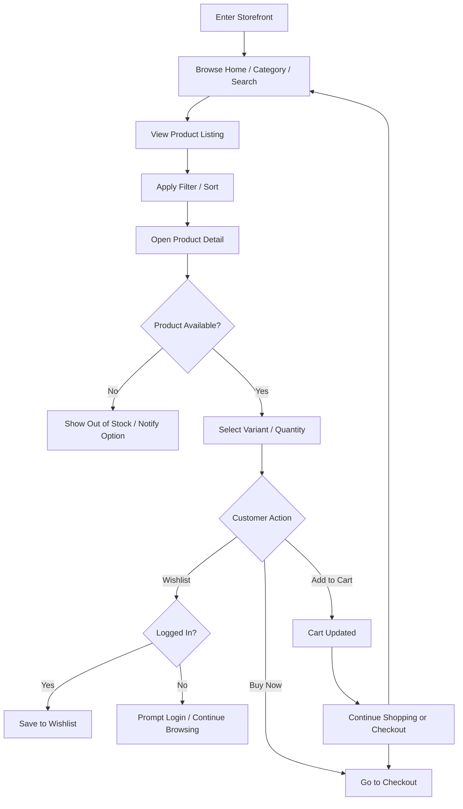
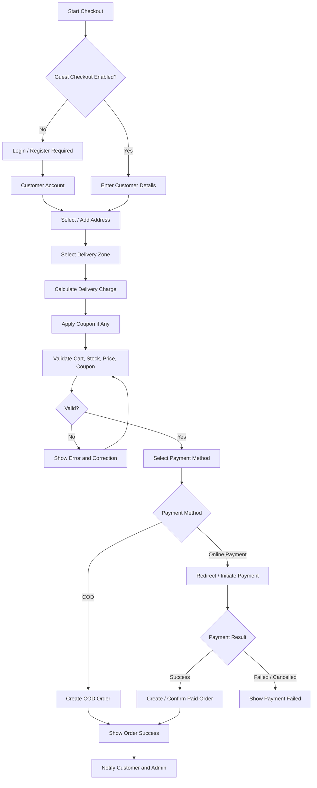
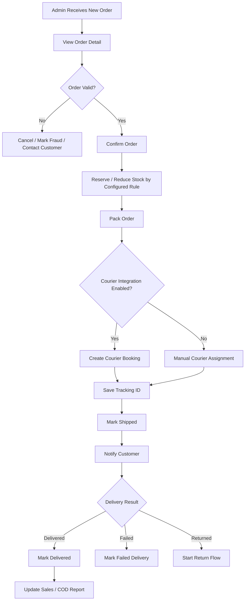
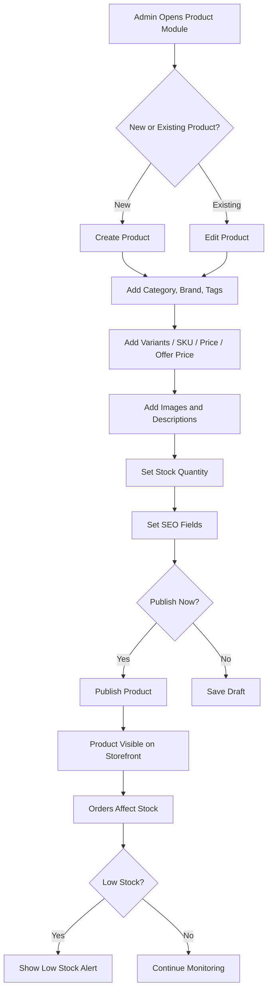
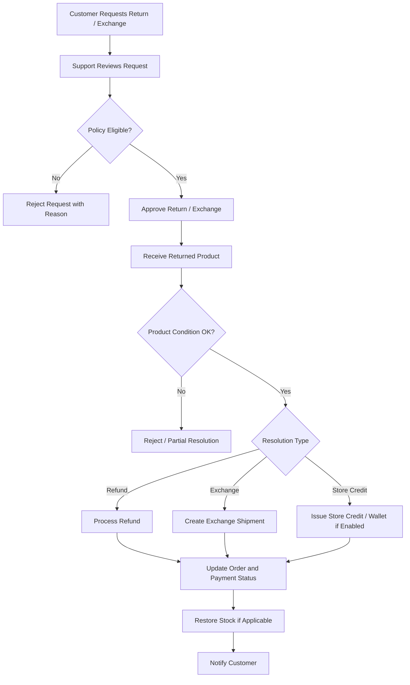
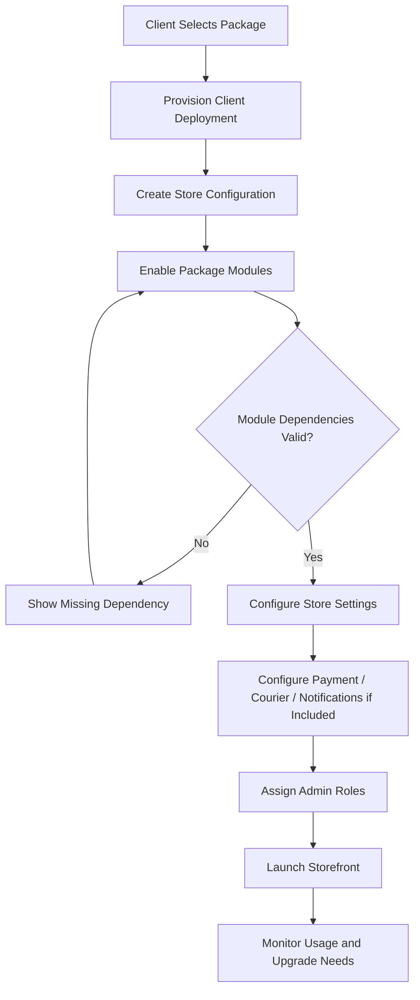
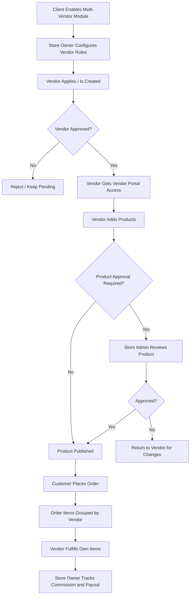

# User Flow Diagram (UFD)

Project: Modular API-Based Ecommerce Platform  
Date: 12 April 2026  
Version: 1.0

## 1. Purpose

This document defines the main user flows for the API-based ecommerce platform. It covers customer shopping, checkout, admin operations, payment, delivery, inventory, and return/refund flows.

## 2. High-Level Platform Flow

## 3. Customer Shopping Flow

## 4. Checkout Flow

## 5. Admin Order Processing Flow

## 6. Product And Inventory Flow

## 7. Return, Refund, And Exchange Flow

## 8. Package / Module Activation Flow

## 9. Optional Multi-Vendor Flow

## 10. Key Flow Notes

- Guest checkout should be configurable by store.
- COD must work without online payment gateway.
- Online payment must use verified callbacks/webhooks and idempotent processing.
- Courier integration must be adapter-based so providers can be changed.
- Inventory changes must be recorded in stock movement history.
- Disabled modules must be hidden from admin and blocked at API level.
- Customer business data must remain exportable.
- Admin actions on order, stock, payment, and permission changes must be audit logged.
- Multi-vendor flow must stay disabled for normal single-vendor clients and only activate through package/module configuration.
- Each client should be provisioned as a separate deployment with isolated database/storage unless a future SaaS model is intentionally chosen.
