# Workflow Design - State Machines

Project: Modular API-Based Ecommerce Platform  
Date: 13 April 2026  
Version: 1.0

## 1. Purpose

This document defines the major workflow/state-machine rules for the ecommerce platform. These workflows should be implemented in backend services or state-machine classes so that storefront, admin, vendor, payment, courier, and reporting behavior remains consistent.

The platform uses separate deployment per client, single-vendor ecommerce by default, and optional multi-vendor marketplace mode.

## 2. State Machine Design Rules

- Every state transition must be validated by backend logic.
- Every business-critical transition must create an audit log.
- Order, payment, shipment, inventory, and vendor transitions must be permission-controlled.
- Webhook-driven transitions must be idempotent.
- Vendor-specific transitions must enforce vendor ownership when multi-vendor mode is enabled.
- UI should never decide final workflow state on its own; UI requests transitions and backend approves/rejects.

## 3. Order State Machine

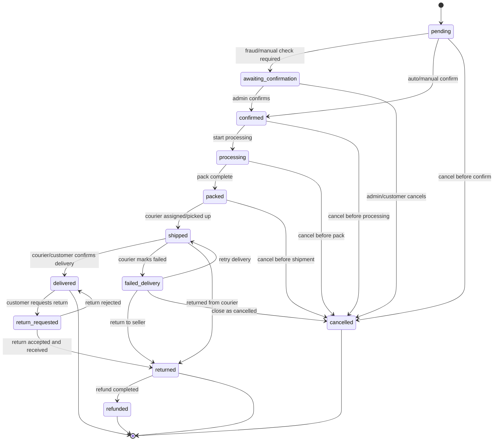

Transition rules:

- `pending -> confirmed` may be automatic for prepaid orders or manual for COD.
- `pending/confirmed/processing/packed -> cancelled` is allowed only before shipment unless admin override is granted.
- `shipped -> delivered` can be triggered manually or by courier webhook.
- `delivered -> return_requested` is allowed only inside the configured return window.
- Exchange and store-credit outcomes are handled by the return workflow, not by writing `exchanged` or `store_credit_issued` into `orders.status`.
- Every transition writes `order_status_histories` and `audit_logs`.
- Stock adjustment behavior depends on store setting: reduce stock at order creation, confirmation, or packing.

## 4. Payment State Machine

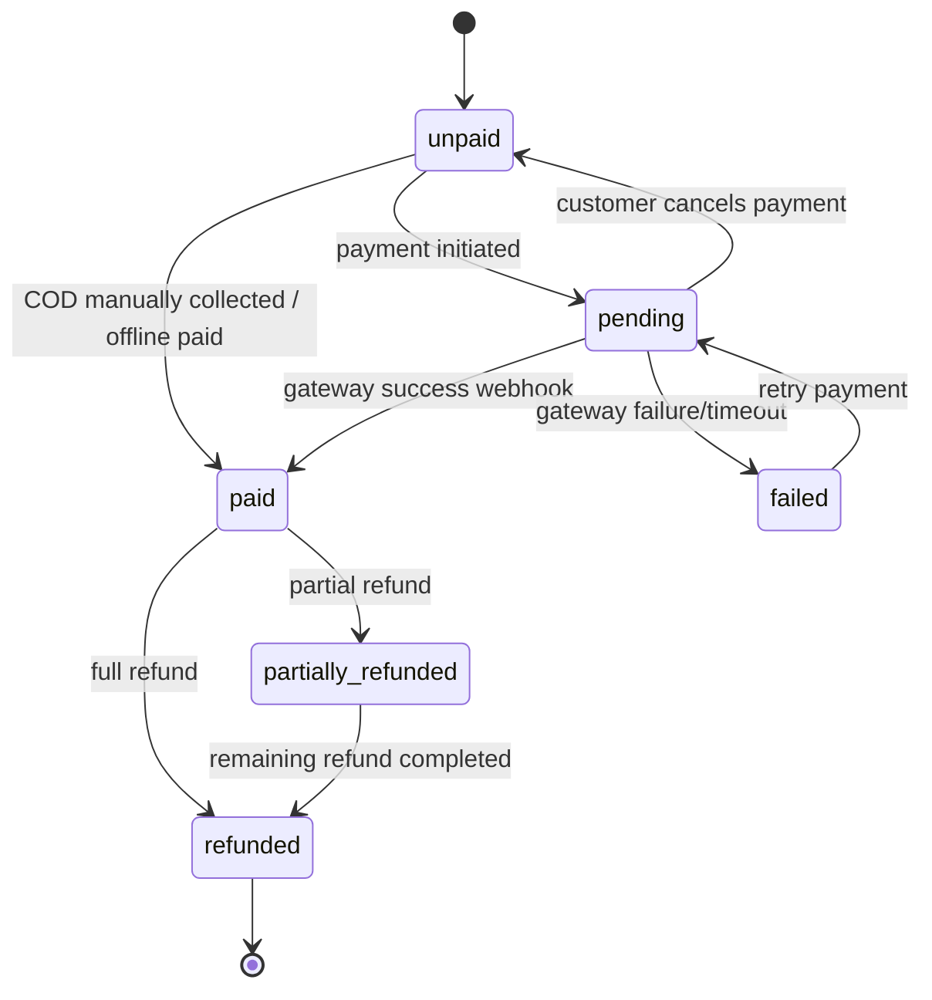

Transition rules:

- COD orders may remain `unpaid` or `pending` until collection, depending on store policy.
- Online payment webhooks must be verified and idempotent.
- Duplicate successful payment events must not double-confirm an order.
- `paid -> refunded` requires refund permission and provider/manual refund confirmation.
- Payment status changes must update the related order financial status.

## 5. Shipment And Courier State Machine

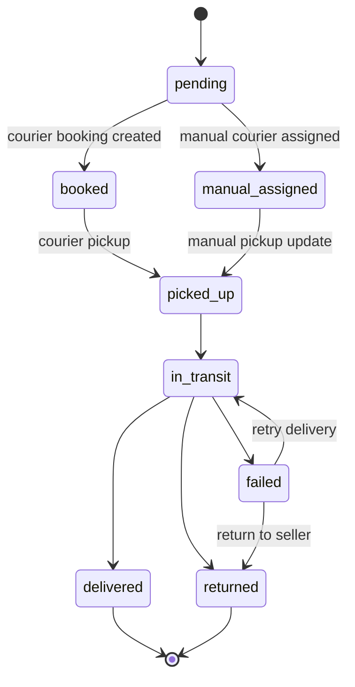

Transition rules:

- Shipment may be manual or API-based.
- Courier webhook can update `booked`, `picked_up`, `in_transit`, `delivered`, `failed`, or `returned`.
- Courier webhook processing must be idempotent.
- Shipment `delivered` may trigger order `delivered`.
- Shipment `returned` may trigger order `returned` or `failed_delivery` depending on courier data and business rule.

## 6. COD Collection State Machine

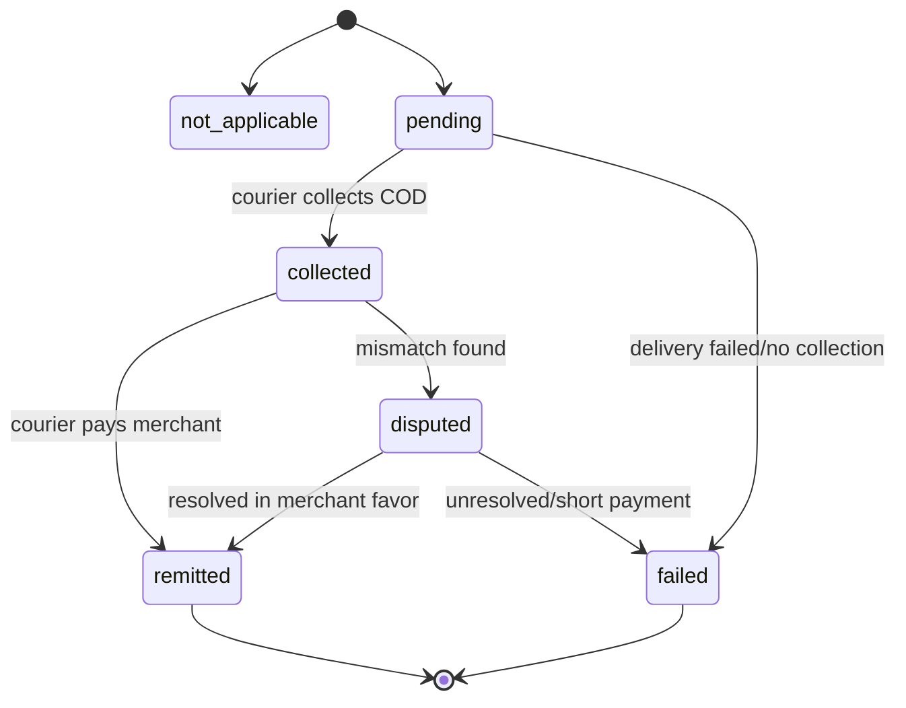

Transition rules:

- Non-COD orders use `not_applicable`.
- COD collection status can come from courier webhook, manual update, or reconciliation upload.
- COD amount must match order payable amount unless admin override is recorded.
- Disputes should appear in reports.

## 7. Return, Refund, And Exchange State Machine

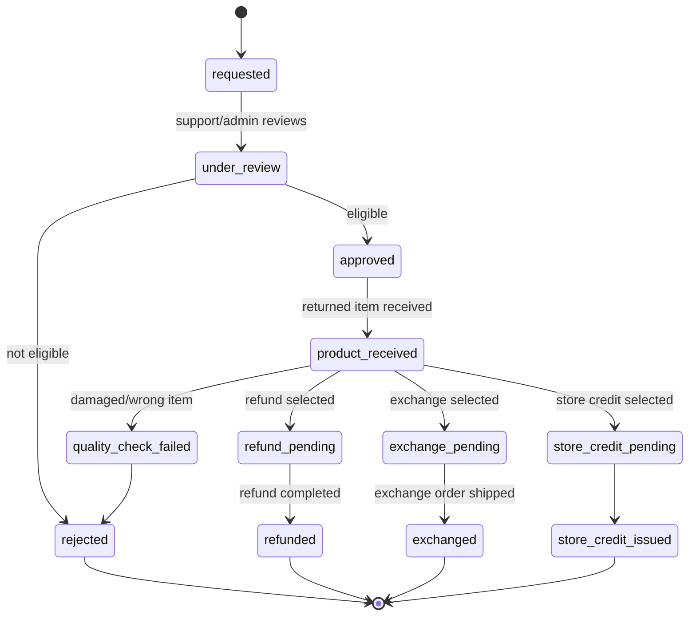

Transition rules:

- Return request must reference an order and order item.
- Return eligibility depends on return window, product type, and policy.
- Stock restoration happens only after approved return receipt, unless business policy says otherwise.
- Refund transition must update payment and order status.
- Exchange may create a new shipment or linked exchange order.
- `exchanged` and `store_credit_issued` are return-resolution states on the return/exchange record; they are not core `orders.status` values in version 1.

## 8. Product Publishing State Machine

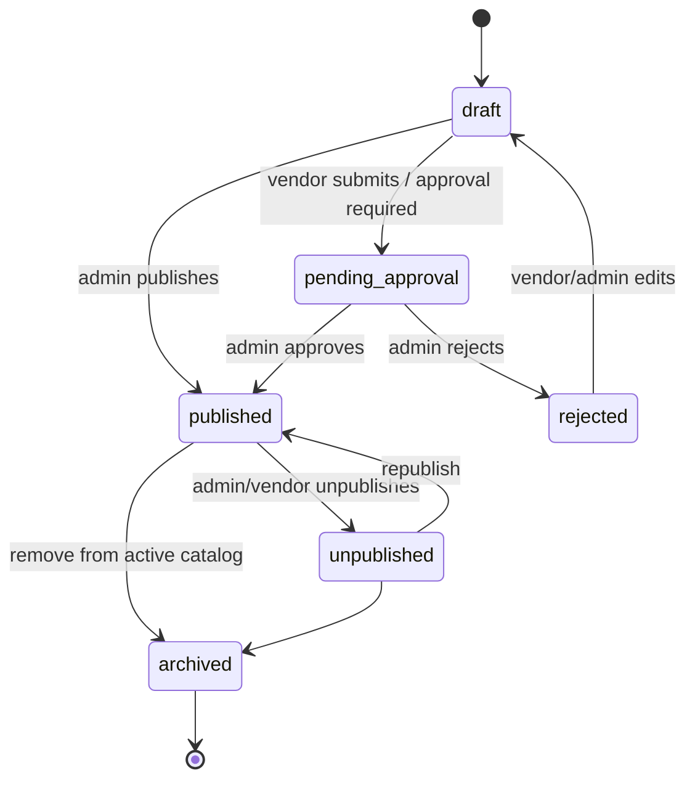

Transition rules:

- Single-vendor admin products can go `draft -> published` directly.
- Vendor products usually go `draft -> pending_approval -> published`.
- Rejected vendor product must include rejection reason.
- Published product requires category, price, status, and stock behavior.
- Product publish/unpublish should update search index if search module is enabled.

## 9. Inventory Movement State Machine

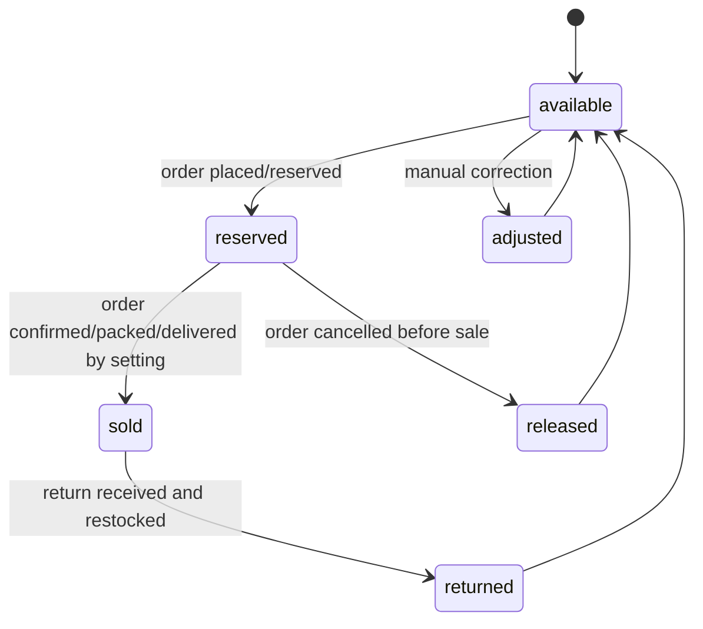

Transition rules:

- Inventory is not only a state; every change must create `inventory_movements`.
- `reserved -> sold` timing depends on store setting.
- Manual adjustment requires reason and permission.
- Vendor stock adjustment must be vendor-scoped in multi-vendor mode.
- Current stock must be derived from `quantity_on_hand` and `quantity_reserved`.

## 10. Vendor Onboarding State Machine

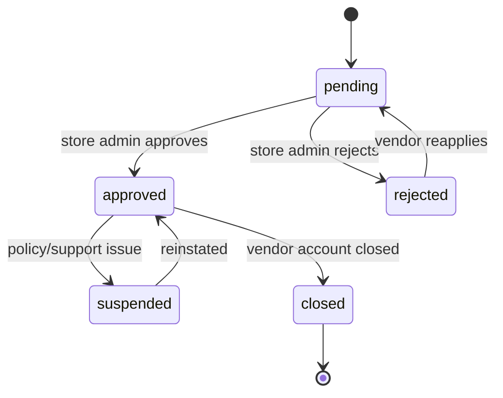

Transition rules:

- Vendor module must be enabled before vendor onboarding is available.
- Vendor cannot publish/manage products until approved.
- Suspended vendors cannot receive new orders or update storefront-visible products.
- Vendor status changes require audit logs.

## 11. Coupon State Machine

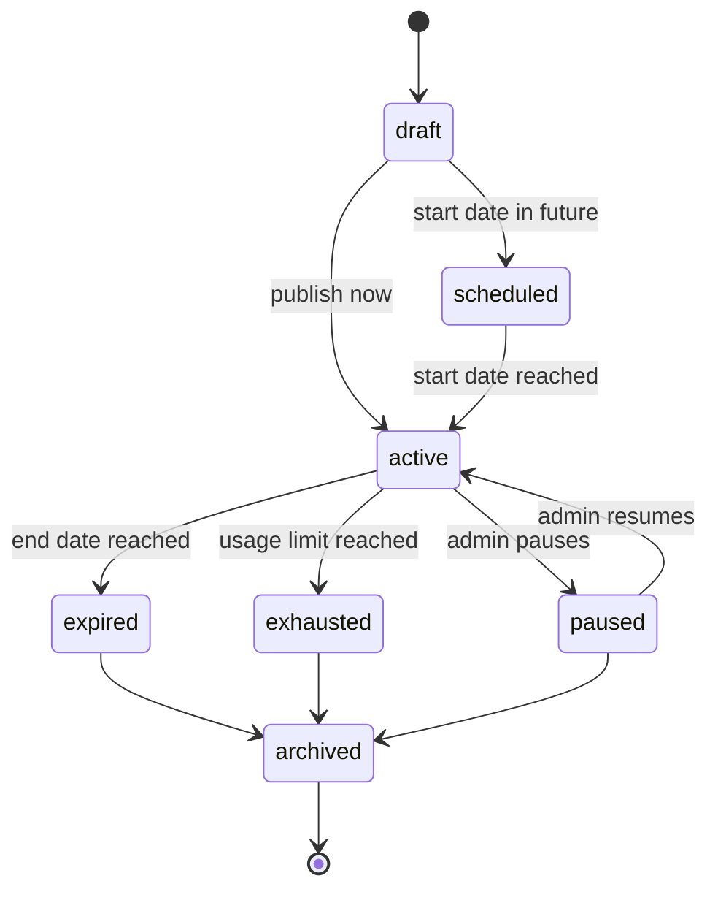

Transition rules:

- Coupon code must be unique per store.
- Active coupon must satisfy date, usage, customer, product/category, and minimum order rules.
- Coupon redemption must be recorded against order and customer where available.
- Coupon usage count must update atomically during checkout/order creation.

## 12. Module Activation State Machine

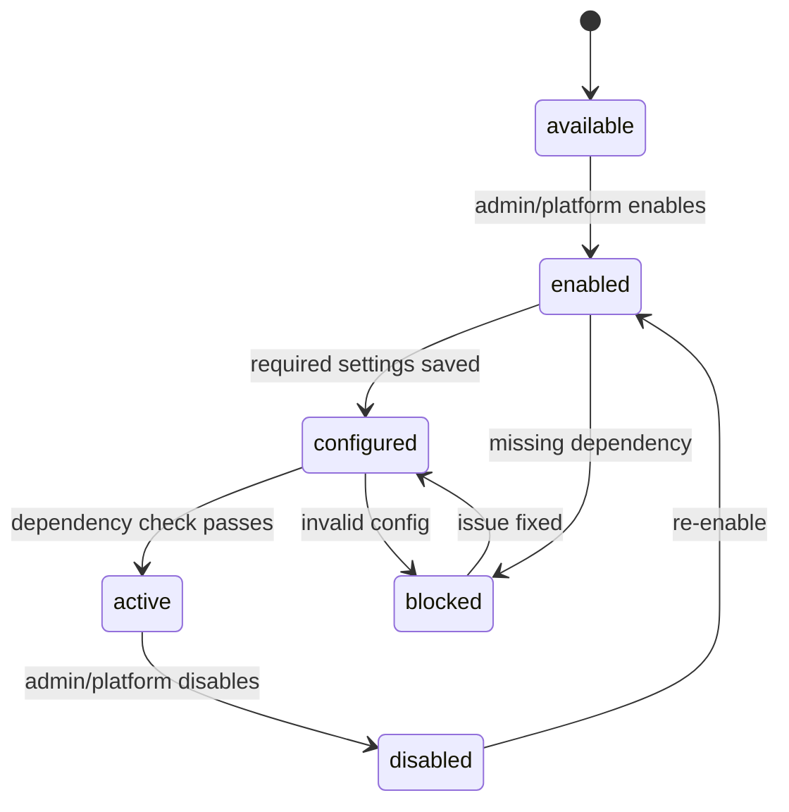

Transition rules:

- Module dependencies must be checked before activation.
- Disabled modules must be blocked at UI and API level.
- Multi-vendor module activation must require commerce mode review.
- Payment/courier modules must require provider credentials before active use.

## 13. Notification State Machine

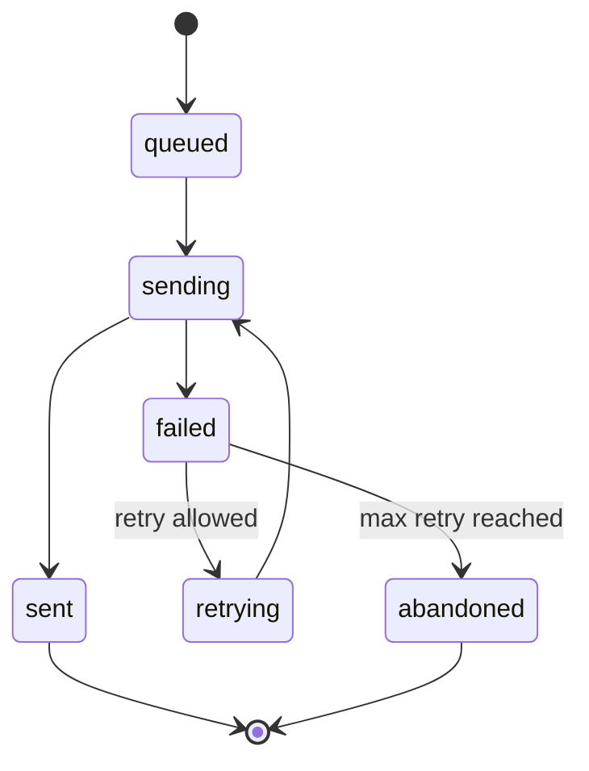

Transition rules:

- Notifications should be queued.
- Failed notifications should be logged with provider response.
- Retry policy may vary by channel.
- Order/payment notifications should not block checkout completion.

## 14. Workflow Ownership Matrix

| Workflow | Primary Module | Trigger Sources | Audit Required |
|---|---|---|---|
| Order state | Order | Admin, customer, courier webhook, payment webhook | Yes |
| Payment state | Payment | Payment gateway, admin, COD reconciliation | Yes |
| Shipment state | Shipping | Admin, courier webhook | Yes |
| COD collection | Shipping/Payment | Courier webhook, reconciliation, admin | Yes |
| Return/refund/exchange | Order/Payment/Inventory | Customer support, admin | Yes |
| Product publishing | Catalog/Vendor | Admin, vendor | Yes |
| Inventory movement | Inventory | Order, return, admin, vendor | Yes |
| Vendor onboarding | Vendor | Store admin, vendor application | Yes |
| Coupon lifecycle | Promotion | Admin, scheduler | Yes |
| Module activation | Module/Store | Platform admin, store owner | Yes |
| Notification state | Notification | Queue worker/provider | Log required |

## 15. Implementation Notes

- Use enum-like constants for states; do not scatter raw strings throughout code.
- Keep transition rules in state-machine classes or dedicated services.
- Add tests for allowed and blocked transitions.
- Any webhook-driven transition must check whether the event was already processed.
- Store transition timestamps and actor IDs for business-critical workflows.
- For multi-vendor mode, order item/vendor state should never allow one vendor to update another vendor's data.
